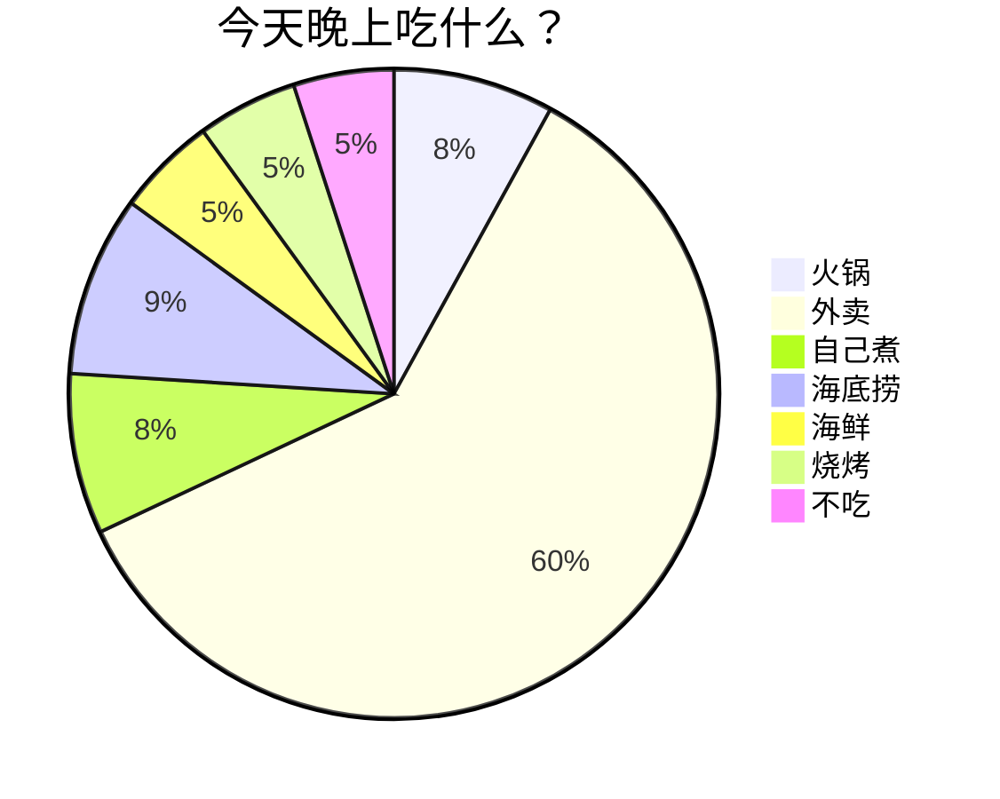
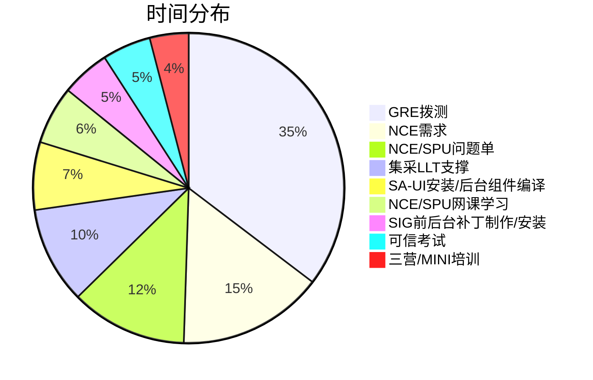
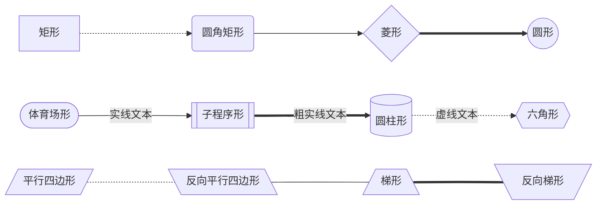
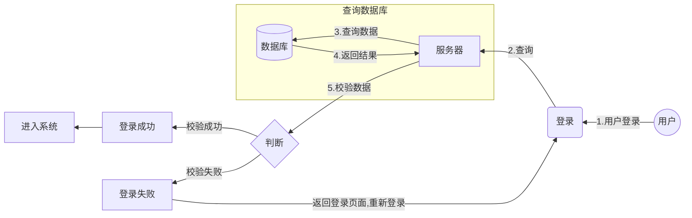
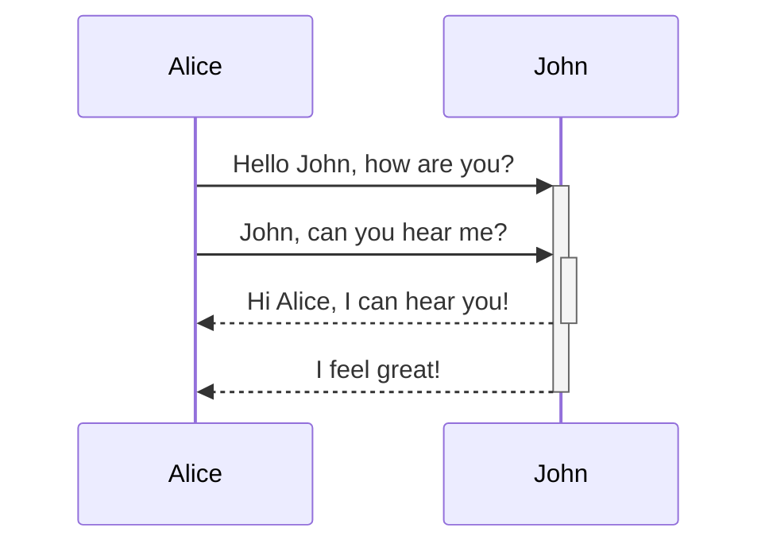
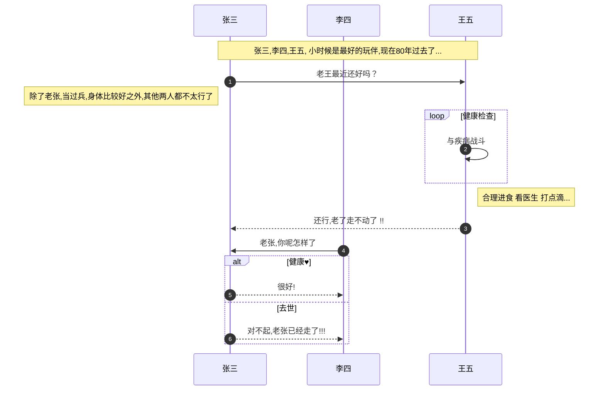
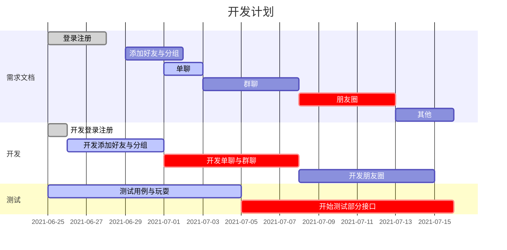
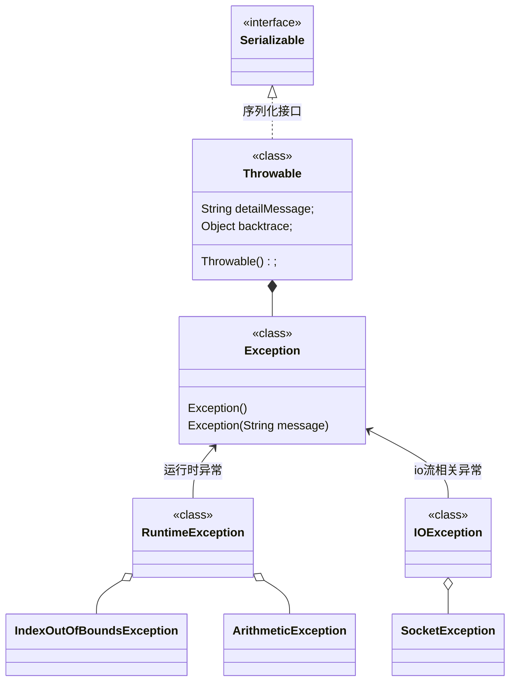
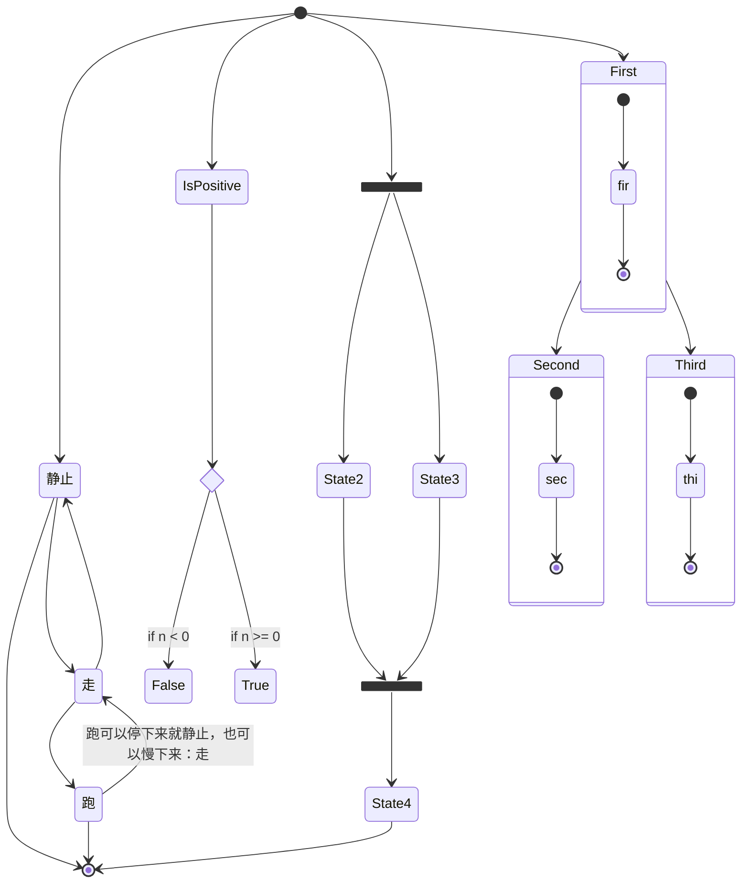
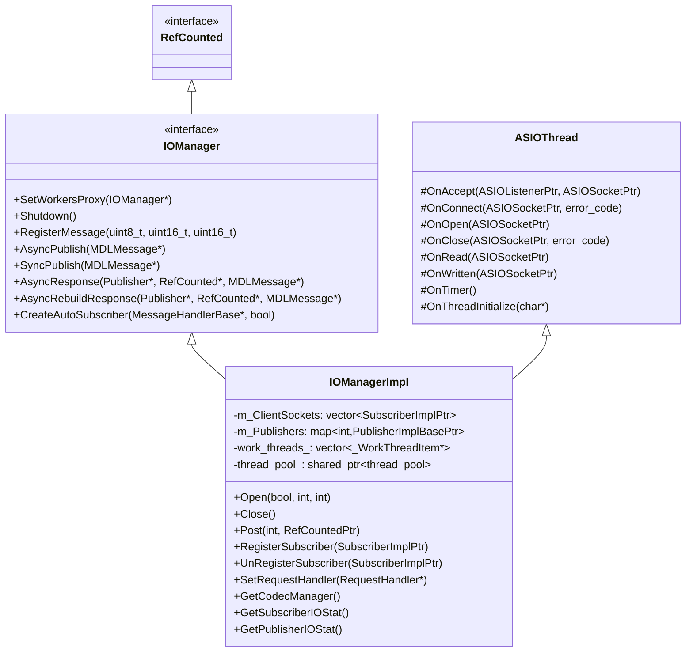

---
{"dg-publish":true,"permalink":"/zettel/202305222026mermaid-tutorial/","title":202305222026,"tags":["mermaid","graph","draw","画图","作图"]}
---

Pie
-----

Flow chart
---

Sequence diagram
---

Gantt
---

Class diagram
---

State diagram
---

References
---

1. [Mermaid doc][1]
2. https://rstyro.github.io/blog/2021/06/28/Markdown%E6%B5%81%E7%A8%8B%E5%9B%BE%E8%AF%AD%E6%B3%95%E7%A4%BA%E4%BE%8B/
3. https://www.drawio.com/blog/mermaid-diagrams

[1]:https://mermaid.js.org/intro/n00b-syntaxReference.html
[2]:https://rstyro.github.io/blog/2021/06/28/Markdown%E6%B5%81%E7%A8%8B%E5%9B%BE%E8%AF%AD%E6%B3%95%E7%A4%BA%E4%BE%8B/