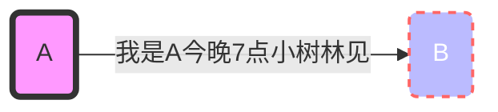
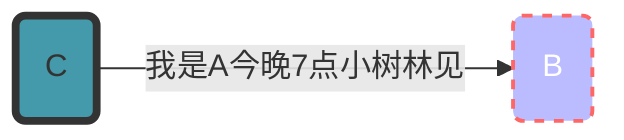
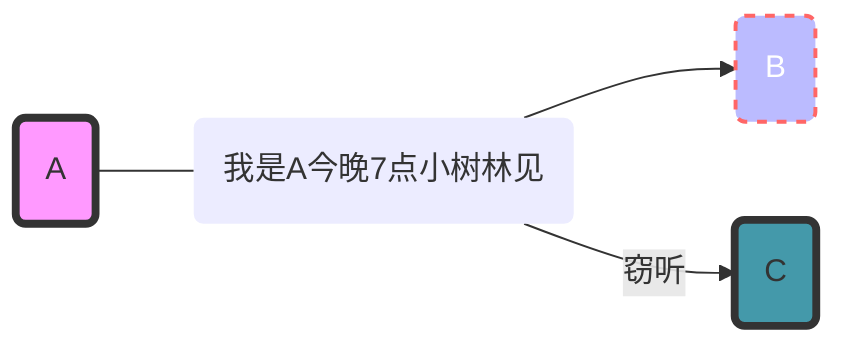
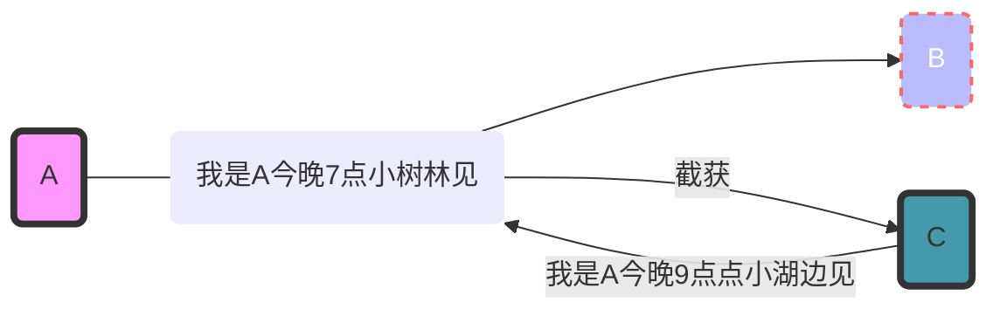

---
{"dg-publish":true,"permalink":"/__zettel/202306071056对称加密和非对称加密/","title":202306071056,"tags":["加密","安全","密钥"],"created":"2023-06-07T10:56:08+08:00"}
---

明文通信的弊端
---

1. 冒充
2. 窃听
3. 篡改

冒充：

窃听：

篡改：

---

- 对称密钥：指通信的双方使用同一个密钥进行加解密。
- 非对称密钥：成对出现，一个称为公钥，可对外公开。一个称为私钥，仅自己持有。

对称加密
---

常见对称加密算法：

1. DES
2. AES

消息认证码的通信机制：

非对称加密
---

密钥交换/协商
---

这个过程是很重要的，尤其是对与对称加密算法而言。对称加密要想work，必须使得通信的双方具备同一个密钥，且不能被第三方知晓。要做到这一点，有两条路子：

1. 提前（可能是很久之前，具备预见性）在通信的双方使用安全的方法部署好同一个密钥，供后续通信使用；
2. 通信前使用安全的方法确定密钥（密钥交换/协商）。

第一种方式显然不太科学，缺乏灵活性和预见性。第二种方式有个依赖：**如何才能安全地交换密钥信息呢？**

### 基于加密通道传输密钥

这种就是使用非对称加密算法，发送方使用接收方公钥加密密钥（这是用于后续通信的密钥），然后直接发给接收方，接收方使用私钥解密，这样双方都有了同一个密钥。

### 基于通信双方共享的密钥

比如PSK算法，双方预先部署若干个共享的密钥，通过密钥编号（明文传输）协商使用哪个密钥。这是一种比较朴素的加密通信，相当少双方持有同一个密码本，然后发送“密文”（密钥编号），双方查询密码本确定明文（后续通信要用的密钥）。其实密钥编号可被中间人获取，但他不知道编号的意义。

see also DH 算法。

1. https://www.peterjxl.com/JavaSE/encrypt-dh/
2. https://blog.51cto.com/u_13291771/2798365

---

<?xml version="1.0" encoding="UTF-8"?>
<!-- Do not edit this file with editors other than draw.io -->
<!DOCTYPE svg PUBLIC "-//W3C//DTD SVG 1.1//EN" "http://www.w3.org/Graphics/SVG/1.1/DTD/svg11.dtd">
<svg xmlns="http://www.w3.org/2000/svg" xmlns:xlink="http://www.w3.org/1999/xlink" version="1.1" width="861px" height="325px" viewBox="-0.5 -0.5 861 325" content="&lt;mxfile host=&quot;app.diagrams.net&quot; modified=&quot;2023-06-08T06:19:38.736Z&quot; agent=&quot;Mozilla/5.0 (Windows NT 10.0; WOW64; x64) AppleWebKit/537.36 (KHTML, like Gecko) Chrome/113.0.5666.197 Safari/537.36&quot; version=&quot;21.3.7&quot; etag=&quot;0_Ng0r9d5PG7jn44j8ij&quot; type=&quot;device&quot;&gt;&lt;diagram name=&quot;第 1 页&quot; id=&quot;RZaw-xBN4gSjKIZRX8cm&quot;&gt;5VtLk5s4EP41HOPijXQEP3YP2a1U5bDJaYsB2WaDLS/IGTu/fltCAgOaMZ7B9sxsKlUDrXd/n7pbLWw4083htyLerf+gKckN20wPhjMzbNsyfQf+cMmxknjIrwSrIktlpUbwNftFVEsp3WcpKVsVGaU5y3ZtYUK3W5KwliwuCvrYrrakeXvUXbwiPcHXJM770r+ylK0rKbKDRv47yVZrNbLl46pkE6vKciXlOk7p44nImRvOtKCUVU+bw5TkXHlKL1W7xROl9cQKsmVDGthVg59xvpdrk/NiR7XYgu63KeH1LcOJHtcZI193ccJLHwFekK3ZJpfFyyzPpzSnhWjrLOEfMkFesoL+IKokJct4n8MEo1UelxwMUUfpQrz8ICxZy16TffGTLDLGsu1Kiv7JVisxQ7vuXUFhTjyQyYWRgpHDk8qxapUDVwndEFYcoYpqEEiUJE2RKd8fG9AdT8rWJ4DX8MaSaKu67wYLeJBw6KFx+tDMPQMtDGwZc2yAWhE8+Ab2jQj3UINVszY0bQi2dEs6eElRnGerLbwmoCUC8ojrMAPyh7Jgk6UpH0bLhYYt5jggOJZ3FgRfg4EzAgRuT60kBUMgX2nB1nRFt3E+b6QdBTR1PlO6U9wljB2lVYv3jLZxAr0Ux2+yvXj5XpNavM4Op4WzY0vXfIItTZd0XyRSJDXJ4mJFFFXdwYAUJI9Z9rPd/WvU62kZHi4McAcVsVEwrjlCCUmS3l6Akgfkud5IjHVdZ9LhLHZvxllfo1RQ5NwIPaFU14j8xmxwiwIqn3KLgm1e5w6MH8DcYDAIg1kqm36hGfTYgGd1wcNWB5Vq+8h2DTBhUcTHk2o7XqG8aCSv46wvbQEP1SwaptSaGUSe4Hw4UDtmDnZc7qr4apkdOAMisWhSzH8SvnbpeE79ehqX65or57xTHj+Q/AstM5ZRrUv63KnwQBmjG43PYpyKfdfWsQ+maSE0q6a84+vdHFY8gp1syiQmE9FqV2Qlmfwgx793pNhkZQkjl2NYDdObBG1wg76ns7yJfx27gbR2A2INjIw5MkJfhBuBEc4NHPCiyDHwWzUXasueejrLvp+n68dnNw0kJm4rlDgTSIi3L6TIYJl8l0hhGvKTE58ucKSSLLL8taD49wNFzadDeXCPCAmfafFYZMz4I40JWmrjDz9B5GE5TvxhB1Y7+vBuF31Yljame+rUwu1JICR3DD9eGnCTQ8a+NTXh7bvqEZ6bRvzlgiBd2anWNrlClP6ioKUGWPko1x01AFGLf94Nvb89aaHOnrzhicBy3pL3sc7tqmt5H/eNeR9Xw3QwhzMjmnOTicFSzsZlukdQ6uqYjuwHx/ev432wCn5uwfR35T+GkNbvk9a7I2d1yYWKqog/gEeP/B4E/VTk8BRjQcrsV/wgujLV+VKswIsMjx/VOB5lBc0lWc4RmO645226Ljs8CtMHnNT/v4l7D9ttZMw+Mo6P+tCMkri39Efpp1Jw57fLO83cB373+uSGMQ8+vz/et2uoLz5PXIMzHKPRfYOtP02/KIEk0nrXcxlPclveF8vGRr2mlj7xs6T/ZE4sB8uI+6W5aFWFLpclYT0ULjtS2boj+QdIcwSu3zYv3u0uBj+eNdGcjlRK+O5Jh8BpOxJs4lOwztd3cAfc1yUp7DsfqG+D/hV8yV3QR743Lvq6g/sHuLb2Vdx6hxSV9lOAZ26t30LaeMi+ukJ+SU96H7fBwyq9NPKldW8cr5X/vbT+6zejJiPR5cJNbqxPN+Otr60b+3D7a2sfm5P2YRsHfbtxvWtr3ScLz104vYXvXa7pyVHfkzv2+FZoMDy6XMgHyHJ3Dx/YvqGzvMvXBCVQiqlLmDSLN3SbKrG8ienc1DSVmssas0X/hvFDvksYQH9HlxS5Av31zg5bnQ943GFfjr3A7zn6bAsEoRAqVdGoJrX41nMr9tncim12ku6fJLpvItXi6FMt7/72GqE2sW+ZalHb96Pr9JYexNH8tsD2xb3Okopt0ajS/3dPVcGn6qIthApodxB6UMUgWsZJu8kULHMGBsU2/ySPp1X9lfgL6EVgsOrz3KwVp0VTHsVxCZSqoA7s2hzOgpE4F2JOgagyfDNRB2qGBnJkZMHDvIXoZypaQf3FsH48fpbHtgwX4T/v0Bb9BLxtaKlTKUzVEUFmdRMKHZqiZ+gw1KRZq6KwWilMDJ/5OgrDclxNxNRa10xkHuqeMddY5ApJKKeBIq7qqg5v7vFZReYJBFXzUDdWvcBnTuS15KKenwEFcUqEAkrYKXpl9q8XqkEFtQAjrp+eU2xU18e9PwTi8jDS4T6MWpyQU9HPQoLbHaJGuc8EJB68BgK5S2GDVxtV7qSu+Ttj8LrnxIe4zJJJSpP9RlivaE2L7BcMEHdDhJws2XMBwmW3v6fH7BFMqmW3M3+B3XdTlqmxqdYLjCq8Nj/Tq2KF5seOzvw/&lt;/diagram&gt;&lt;/mxfile&gt;"><defs/><g><rect x="60" y="90" width="350" height="220" rx="33" ry="33" fill="none" stroke="none" pointer-events="all"/><path d="M 68.2 98.31 C 68.2 98.31 68.2 98.31 68.2 98.31 M 68.2 98.31 C 68.2 98.31 68.2 98.31 68.2 98.31 M 65.11 104.91 C 65.14 100.71 71.52 100.57 73.64 95.09 M 65.11 104.91 C 67.83 101.49 70.7 97.54 73.64 95.09 M 62.69 110.75 C 72.14 101.3 76.49 99.88 79.09 91.88 M 62.69 110.75 C 65.38 104.44 71.09 98.8 79.09 91.88 M 60.92 115.83 C 64.23 105.84 76.14 102.52 81.91 91.68 M 60.92 115.83 C 67.21 108.45 78.01 99.7 81.91 91.68 M 61.11 118.65 C 69.91 114.41 74.72 105.45 84.73 91.48 M 61.11 118.65 C 67.94 109.72 77.05 100.09 84.73 91.48 M 61.31 121.47 C 67.38 112.2 73.84 108.3 87.55 91.29 M 61.31 121.47 C 69.97 113.24 75.43 103.92 87.55 91.29 M 60.85 125.05 C 70.35 112.01 85.82 93.93 91.03 90.33 M 60.85 125.05 C 68.08 114.86 76.93 108.13 91.03 90.33 M 61.05 127.87 C 73.77 115.75 83.62 109.93 93.85 90.14 M 61.05 127.87 C 72.62 111.94 87.44 98.09 93.85 90.14 M 61.25 130.69 C 68.84 123.1 83.58 106.88 96.02 90.69 M 61.25 130.69 C 69.25 120.46 80.76 109.74 96.02 90.69 M 60.79 134.27 C 69.35 117.77 81.26 108.39 98.84 90.5 M 60.79 134.27 C 73.34 117.16 88.85 100.92 98.84 90.5 M 60.99 137.09 C 76.63 122.96 91.45 101.81 101.66 90.3 M 60.99 137.09 C 74.11 119.26 89.84 104.06 101.66 90.3 M 61.18 139.91 C 77.03 118.15 92.42 105.01 103.83 90.86 M 61.18 139.91 C 74.7 122.67 85.63 108.2 103.83 90.86 M 60.72 143.49 C 71.99 123.01 89.41 103.48 106.65 90.66 M 60.72 143.49 C 78 126.1 94.29 105.75 106.65 90.66 M 60.92 146.31 C 76.01 127.15 97.19 107.42 109.47 90.46 M 60.92 146.31 C 75.29 127.53 92.43 111.36 109.47 90.46 M 61.12 149.13 C 84.17 129.07 101.07 103.3 112.29 90.26 M 61.12 149.13 C 79.4 128.39 93.11 107.08 112.29 90.26 M 60.66 152.71 C 76.6 140.63 85.55 121.05 114.46 90.82 M 60.66 152.71 C 76.14 135.28 94.75 115.9 114.46 90.82 M 60.86 155.53 C 83.09 131.91 99.54 110.47 117.28 90.62 M 60.86 155.53 C 75.66 137.57 95.25 117.12 117.28 90.62 M 61.06 158.35 C 74.96 139.19 92.93 122.14 120.1 90.43 M 61.06 158.35 C 73.03 142.04 87.3 128.84 120.1 90.43 M 60.6 161.93 C 85.23 134.83 107.59 110.53 122.92 90.23 M 60.6 161.93 C 78.69 139.83 99.94 119.73 122.92 90.23 M 60.79 164.75 C 83.24 140.19 108.86 108.25 125.09 90.79 M 60.79 164.75 C 83.46 136.37 107.61 109.57 125.09 90.79 M 60.99 167.57 C 81.46 137.16 106.66 117.38 127.91 90.59 M 60.99 167.57 C 76.18 148.58 91.74 130.29 127.91 90.59 M 60.53 171.15 C 80.76 154.08 97.02 129.03 130.73 90.39 M 60.53 171.15 C 83.36 147.11 103.79 120.01 130.73 90.39 M 60.73 173.97 C 86.6 143.68 103.31 125.58 133.55 90.2 M 60.73 173.97 C 85.78 144.88 111.3 113.48 133.55 90.2 M 60.93 176.79 C 83.99 151.06 112.04 117.77 135.72 90.75 M 60.93 176.79 C 90.38 144.27 115.36 110.93 135.72 90.75 M 61.12 179.61 C 83.44 152.29 99.94 125.78 138.54 90.56 M 61.12 179.61 C 86.03 149.91 112.41 120.15 138.54 90.56 M 60.67 183.19 C 90.07 141.86 125.76 109.12 141.36 90.36 M 60.67 183.19 C 90.27 148.93 120.45 114.37 141.36 90.36 M 60.86 186.01 C 86.4 157.29 108.86 127 144.18 90.16 M 60.86 186.01 C 85.35 157.74 109.66 130.71 144.18 90.16 M 61.06 188.83 C 89.43 157.1 113.26 123.95 146.35 90.72 M 61.06 188.83 C 77.62 165.9 95.65 148.01 146.35 90.72 M 60.6 192.41 C 89.44 157.7 111.74 130.1 149.17 90.52 M 60.6 192.41 C 84.89 166.01 109.66 133.71 149.17 90.52 M 60.8 195.23 C 78.61 172.15 104.58 147.89 151.99 90.32 M 60.8 195.23 C 92.35 158.34 119.18 128.55 151.99 90.32 M 61 198.05 C 82.36 175.69 100.34 153.69 154.81 90.13 M 61 198.05 C 84.55 170.34 108.87 142.83 154.81 90.13 M 60.54 201.63 C 85.79 170.26 113.92 149.24 156.98 90.68 M 60.54 201.63 C 84.2 175.98 107.17 146.92 156.98 90.68 M 60.73 204.45 C 86.59 173.11 117.48 139.89 159.8 90.49 M 60.73 204.45 C 91.63 166.97 123.78 128.89 159.8 90.49 M 60.93 207.27 C 93.18 163.43 133.24 119.21 162.62 90.29 M 60.93 207.27 C 85.16 178.09 111.02 153.09 162.62 90.29 M 60.47 210.85 C 85.29 183 112.86 155.36 164.79 90.85 M 60.47 210.85 C 103.08 161.09 145.14 113.68 164.79 90.85 M 60.67 213.67 C 81.08 189.45 101.59 163.64 167.61 90.65 M 60.67 213.67 C 87.1 181.57 118.01 150.59 167.61 90.65 M 60.87 216.49 C 87.5 181.92 114.71 152.68 170.43 90.45 M 60.87 216.49 C 88.69 185.35 112.17 158.22 170.43 90.45 M 60.41 220.07 C 83.75 190.95 110.58 157.57 173.25 90.26 M 60.41 220.07 C 103.56 169.73 142.71 121.92 173.25 90.26 M 60.61 222.89 C 103.15 178.25 143.88 133.13 175.42 90.81 M 60.61 222.89 C 104.51 171.67 147.77 124.19 175.42 90.81 M 60.8 225.71 C 100.08 178.89 139.93 129.41 178.24 90.62 M 60.8 225.71 C 98.55 179.25 138.53 131.72 178.24 90.62 M 60.34 229.28 C 104.33 181.59 141.77 129.35 181.06 90.42 M 60.34 229.28 C 107.2 180.47 150.26 127.1 181.06 90.42 M 60.54 232.11 C 94.8 188.98 134.81 143.79 183.88 90.22 M 60.54 232.11 C 93.14 193.86 124.81 153.54 183.88 90.22 M 60.74 234.93 C 111.7 182.54 163.92 123.69 186.05 90.78 M 60.74 234.93 C 111.44 175.02 160.03 119.3 186.05 90.78 M 60.94 237.75 C 95.02 197.95 132.4 153.24 188.87 90.58 M 60.94 237.75 C 101.83 185.32 146.44 134.66 188.87 90.58 M 60.48 241.33 C 106.17 187.86 160.9 128.31 191.69 90.38 M 60.48 241.33 C 91.55 208.06 121.25 173.43 191.69 90.38 M 60.67 244.15 C 102.59 192.35 148.76 142 194.51 90.19 M 60.67 244.15 C 99.98 202.15 139.36 157.89 194.51 90.19 M 60.87 246.97 C 94.98 201.72 136.1 155.94 196.68 90.74 M 60.87 246.97 C 93.15 207.35 127.6 171 196.68 90.74 M 60.41 250.54 C 104.61 199.92 150.46 150.6 199.5 90.55 M 60.41 250.54 C 98.14 203.35 140.05 157.75 199.5 90.55 M 60.61 253.37 C 104.87 200.03 155 152.31 202.32 90.35 M 60.61 253.37 C 93.94 217.43 126.05 178.07 202.32 90.35 M 60.81 256.19 C 107.42 200.72 152.82 152.52 205.14 90.15 M 60.81 256.19 C 102.47 210.04 145.83 159.87 205.14 90.15 M 60.35 259.76 C 111.47 191.89 168.64 129.19 207.31 90.71 M 60.35 259.76 C 93.46 223.31 126.31 188.48 207.31 90.71 M 60.55 262.59 C 109.13 211.58 151.84 158.31 210.13 90.51 M 60.55 262.59 C 112.36 205.45 160.03 151.14 210.13 90.51 M 60.74 265.41 C 104.21 217.01 149.85 164.79 212.95 90.31 M 60.74 265.41 C 120.63 196.84 180.77 129.56 212.95 90.31 M 60.29 268.98 C 103.24 219.23 147.43 173.29 215.77 90.12 M 60.29 268.98 C 112.48 207.56 163.2 152.58 215.77 90.12 M 60.48 271.8 C 101.77 227.68 147.16 181.45 217.94 90.67 M 60.48 271.8 C 125.35 201.39 186.39 131.02 217.94 90.67 M 60.68 274.63 C 102.6 225.67 140.76 180.85 220.76 90.48 M 60.68 274.63 C 114.17 211.37 166.23 146.52 220.76 90.48 M 60.88 277.45 C 94.88 243.34 126.31 202.76 223.58 90.28 M 60.88 277.45 C 99.33 230.66 138.68 183.62 223.58 90.28 M 61.07 280.27 C 113.78 217.57 165.26 156.61 225.75 90.84 M 61.07 280.27 C 120.64 214.69 177.39 151.02 225.75 90.84 M 61.93 282.34 C 131.91 207.87 195.75 129.99 228.57 90.64 M 61.93 282.34 C 126.5 210.03 189.43 135.39 228.57 90.64 M 62.13 285.16 C 123.61 213.35 185.27 141 231.39 90.44 M 62.13 285.16 C 100.11 244.13 132.03 203.83 231.39 90.44 M 62.98 287.22 C 102.84 242.88 140.66 195.06 234.21 90.25 M 62.98 287.22 C 113.04 230.58 159.99 176.86 234.21 90.25 M 63.18 290.05 C 125.76 219.27 187.15 140.01 236.38 90.8 M 63.18 290.05 C 112.1 229.14 167.09 171.15 236.38 90.8 M 64.03 292.11 C 116 236.96 163.4 176.41 239.2 90.61 M 64.03 292.11 C 128.38 219.55 190.18 148.09 239.2 90.61 M 64.88 294.18 C 118.78 228.49 172.19 167.33 242.02 90.41 M 64.88 294.18 C 121.59 227 178.7 162.59 242.02 90.41 M 65.08 297 C 100.62 252.92 139.71 214.69 244.84 90.21 M 65.08 297 C 123.82 228.64 182.74 162.18 244.84 90.21 M 65.93 299.07 C 103.26 255.65 147.48 202.58 247.01 90.77 M 65.93 299.07 C 114.92 241.84 162.36 187.22 247.01 90.77 M 67.44 300.38 C 114.85 244.08 164.31 193.24 249.83 90.57 M 67.44 300.38 C 113.36 251.77 157.34 200.48 249.83 90.57 M 68.95 301.69 C 107.12 262.37 139.85 216.79 252.65 90.37 M 68.95 301.69 C 115.78 250.18 156.59 201.95 252.65 90.37 M 70.46 303 C 112.21 260.44 149.31 213.81 255.47 90.18 M 70.46 303 C 143.74 217.67 215.83 132.88 255.47 90.18 M 71.97 304.32 C 134.83 227.03 201.59 159.31 257.64 90.73 M 71.97 304.32 C 120.05 251.78 170.87 196.49 257.64 90.73 M 73.48 305.63 C 140.38 230.62 208.32 152.64 260.46 90.54 M 73.48 305.63 C 124.23 242.82 177.8 180.55 260.46 90.54 M 75.65 306.19 C 153.57 221.52 228.78 140.85 263.28 90.34 M 75.65 306.19 C 122.27 246.97 173.39 191.47 263.28 90.34 M 77.81 306.74 C 144.06 224.43 214.73 146 266.1 90.14 M 77.81 306.74 C 121.13 261.49 161.31 212.59 266.1 90.14 M 79.98 307.3 C 152.73 225.74 222.56 145.89 268.27 90.7 M 79.98 307.3 C 131.03 250.06 182.93 188.28 268.27 90.7 M 82.14 307.86 C 123.31 263.11 163.09 212.7 271.09 90.5 M 82.14 307.86 C 140.39 241.55 200.46 172.53 271.09 90.5 M 84.31 308.42 C 144.47 241.51 200.66 173.33 273.91 90.3 M 84.31 308.42 C 132.5 252.93 178.09 197.98 273.91 90.3 M 86.47 308.97 C 130.33 258.59 174.36 208.24 276.73 90.11 M 86.47 308.97 C 140.78 245.14 195.05 181.3 276.73 90.11 M 88.64 309.53 C 139.71 247.68 195.33 188.23 278.9 90.66 M 88.64 309.53 C 134.54 256.82 180.41 204.7 278.9 90.66 M 90.8 310.09 C 151.5 238.83 213.45 171.32 281.72 90.47 M 90.8 310.09 C 151.09 243.82 207.81 179.9 281.72 90.47 M 93.63 309.89 C 136.1 265.21 175.07 216.75 284.54 90.27 M 93.63 309.89 C 132.3 265.59 168.62 221.84 284.54 90.27 M 95.79 310.45 C 146.4 252.16 197.91 195.43 286.7 90.83 M 95.79 310.45 C 144.39 251.86 196.6 194.52 286.7 90.83 M 98.61 310.25 C 153.31 255.17 196.85 199.82 289.53 90.63 M 98.61 310.25 C 139.06 262.05 179.61 213.6 289.53 90.63 M 101.43 310.05 C 143.6 258.29 194.54 207.32 292.35 90.43 M 101.43 310.05 C 168.06 235.17 235.21 161.34 292.35 90.43 M 103.6 310.61 C 146.49 259.46 187.96 216.61 295.17 90.24 M 103.6 310.61 C 155.7 248.98 210.55 188.05 295.17 90.24 M 106.42 310.41 C 166.39 234.7 232.36 167.75 297.33 90.79 M 106.42 310.41 C 167.25 244.43 227.94 176.84 297.33 90.79 M 109.24 310.22 C 170.93 237.92 232.28 165.33 300.16 90.6 M 109.24 310.22 C 156.2 253.45 206.04 196.91 300.16 90.6 M 112.06 310.02 C 183.02 227.31 256.81 141.91 302.98 90.4 M 112.06 310.02 C 173.43 239.87 236.06 167.62 302.98 90.4 M 114.23 310.58 C 170.57 247.57 223.52 189.99 305.8 90.2 M 114.23 310.58 C 184.46 225.2 257.48 143.63 305.8 90.2 M 117.05 310.38 C 182.63 233.53 252.11 154.52 307.96 90.76 M 117.05 310.38 C 191.81 229.35 265.65 145.27 307.96 90.76 M 119.87 310.18 C 198 224.62 270.07 135.67 310.79 90.56 M 119.87 310.18 C 185.84 233.52 248.88 162.42 310.79 90.56 M 122.69 309.98 C 192.51 231.89 258.46 147.61 313.61 90.36 M 122.69 309.98 C 173.03 253.83 221.42 194.88 313.61 90.36 M 124.86 310.54 C 168.55 263.62 214.42 209.86 316.43 90.17 M 124.86 310.54 C 196.41 235.01 261.55 156.26 316.43 90.17 M 127.68 310.34 C 186.27 245.99 239.81 180.22 318.59 90.72 M 127.68 310.34 C 197.79 228.95 270.87 146.84 318.59 90.72 M 130.5 310.15 C 206.45 226.83 278.43 139.78 321.42 90.53 M 130.5 310.15 C 202.4 227.55 274.07 148.89 321.42 90.53 M 133.32 309.95 C 200.65 236.1 261.36 164.25 324.24 90.33 M 133.32 309.95 C 196.83 237.96 258.18 168.32 324.24 90.33 M 135.49 310.51 C 198.29 241.25 253.11 173.6 327.06 90.13 M 135.49 310.51 C 175.06 260.07 218.07 213.54 327.06 90.13 M 138.31 310.31 C 178.78 264.25 215.93 217.26 329.22 90.69 M 138.31 310.31 C 198.64 242.01 258.08 172.07 329.22 90.69 M 141.13 310.11 C 195.88 245.14 256.81 178.72 332.05 90.49 M 141.13 310.11 C 188.95 258.05 234.74 203.29 332.05 90.49 M 143.95 309.92 C 186.6 260.72 225.39 215.31 334.87 90.3 M 143.95 309.92 C 181.43 267.36 221.95 220.21 334.87 90.3 M 146.12 310.47 C 195.53 253.72 246.24 197.81 337.03 90.85 M 146.12 310.47 C 205.09 240.4 266.55 172.64 337.03 90.85 M 148.94 310.28 C 214.89 225.63 289.92 146.26 339.85 90.66 M 148.94 310.28 C 191.95 259.1 234.37 211.28 339.85 90.66 M 151.76 310.08 C 220.32 225.07 294.87 143.54 342.68 90.46 M 151.76 310.08 C 227.31 221.45 302.7 134.68 342.68 90.46 M 153.93 310.64 C 197.21 260.04 237.99 208.66 345.5 90.26 M 153.93 310.64 C 193.3 268.54 229.33 225.22 345.5 90.26 M 156.75 310.44 C 199.64 262.66 242.99 211.55 347.66 90.82 M 156.75 310.44 C 221.29 230.67 290.52 153.85 347.66 90.82 M 159.57 310.24 C 212.29 244.22 267.1 183.31 350.48 90.62 M 159.57 310.24 C 195.34 267.08 237.48 221.15 350.48 90.62 M 162.39 310.04 C 216.39 244.69 271.81 178.64 353.31 90.42 M 162.39 310.04 C 234.92 222.21 311.14 137.87 353.31 90.42 M 164.56 310.6 C 201.02 263.27 240.98 222.47 356.13 90.23 M 164.56 310.6 C 219.67 242.08 281.58 175.42 356.13 90.23 M 167.38 310.4 C 215.43 257.19 264.56 205.15 358.29 90.78 M 167.38 310.4 C 239.57 221.18 315.2 136.68 358.29 90.78 M 170.2 310.21 C 238.51 234.96 306.79 158.71 361.11 90.59 M 170.2 310.21 C 239.83 227.24 312.05 143.7 361.11 90.59 M 173.02 310.01 C 212.17 259.91 250.18 219.4 363.94 90.39 M 173.02 310.01 C 247.07 229.99 316.13 149.06 363.94 90.39 M 175.19 310.57 C 224.96 252.94 276.85 196.85 366.76 90.19 M 175.19 310.57 C 232.6 240.5 293.36 172.5 366.76 90.19 M 178.01 310.37 C 244.46 233.01 314.73 158.24 368.92 90.75 M 178.01 310.37 C 218.38 260.67 263.72 207.77 368.92 90.75 M 180.83 310.17 C 250.25 228.51 322.56 145.23 371.74 90.55 M 180.83 310.17 C 249.95 226.17 322.26 145.16 371.74 90.55 M 183.65 309.97 C 240.62 244.83 300.99 178.5 374.57 90.35 M 183.65 309.97 C 224.74 264.33 263.62 218.23 374.57 90.35 M 185.82 310.53 C 249.35 237.64 312.63 161.05 377.39 90.16 M 185.82 310.53 C 242.15 245.01 299.13 175.86 377.39 90.16 M 188.64 310.34 C 240.19 251.29 294.29 192.87 379.55 90.71 M 188.64 310.34 C 232.82 260.32 277.91 210.42 379.55 90.71 M 191.46 310.14 C 238.28 250.21 289.37 193.57 381.72 91.27 M 191.46 310.14 C 263.63 225.25 338.47 140.02 381.72 91.27 M 194.28 309.94 C 271.12 227.43 346.37 141.85 383.88 91.83 M 194.28 309.94 C 258.25 239.82 321.54 167.14 383.88 91.83 M 196.45 310.5 C 237.4 259.6 286.94 205.58 386.05 92.39 M 196.45 310.5 C 266.88 226.2 337.56 146.16 386.05 92.39 M 199.27 310.3 C 274.13 225.16 345.45 141.1 388.22 92.94 M 199.27 310.3 C 251.53 249.17 306.63 187.28 388.22 92.94 M 202.09 310.1 C 260.15 244.28 316.75 174.58 390.38 93.5 M 202.09 310.1 C 270.83 229.69 341.4 147.4 390.38 93.5 M 204.91 309.91 C 241.77 261.62 285.86 216.69 392.55 94.06 M 204.91 309.91 C 268.87 237.3 330.14 166.68 392.55 94.06 M 207.08 310.46 C 246.84 261.07 290.17 214.77 394.71 94.62 M 207.08 310.46 C 265.05 240.68 328.84 168.22 394.71 94.62 M 209.9 310.27 C 262.58 247.2 314.11 188.83 397.53 94.42 M 209.9 310.27 C 256.81 254.33 304.27 200.4 397.53 94.42 M 212.72 310.07 C 269.67 239.9 330.2 176.32 398.39 96.49 M 212.72 310.07 C 285.9 229.16 359.04 143.72 398.39 96.49 M 214.89 310.63 C 261.85 258.35 314.49 200.86 399.9 97.8 M 214.89 310.63 C 275.14 241.51 334.74 174.11 399.9 97.8 M 217.71 310.43 C 290.27 226.02 360.42 138.24 401.41 99.11 M 217.71 310.43 C 278.39 241.65 338.66 169.57 401.41 99.11 M 220.53 310.23 C 269.88 259.52 315.46 207.91 402.91 100.42 M 220.53 310.23 C 284.38 238.96 345.55 171.47 402.91 100.42 M 223.35 310.03 C 273.15 247.23 324.63 189.28 404.42 101.73 M 223.35 310.03 C 281.65 243 339.62 180.5 404.42 101.73 M 225.52 310.59 C 287.55 237.46 355.58 165.37 405.93 103.05 M 225.52 310.59 C 295.45 230.86 366.76 149.68 405.93 103.05 M 228.34 310.39 C 281.27 247.15 336.58 186.42 406.13 105.87 M 228.34 310.39 C 282.69 245.01 335.45 181.9 406.13 105.87 M 231.16 310.2 C 298.76 231.33 368.46 154.36 406.98 107.93 M 231.16 310.2 C 281.16 252.59 331.78 193.09 406.98 107.93 M 233.98 310 C 286.66 248.96 343.73 184.76 407.18 110.76 M 233.98 310 C 291.76 245.55 344.69 183.48 407.18 110.76 M 236.15 310.56 C 290.67 243.96 353.4 181.25 408.04 112.82 M 236.15 310.56 C 299.68 237.03 360.1 165.75 408.04 112.82 M 238.97 310.36 C 294.66 244.54 356.53 180.99 408.23 115.64 M 238.97 310.36 C 292.69 245.21 344.88 183.96 408.23 115.64 M 241.79 310.16 C 286.83 261.19 329 213.85 409.09 117.71 M 241.79 310.16 C 280.34 267.39 318.39 224.61 409.09 117.71 M 244.61 309.97 C 299.44 245.76 353.84 181.89 409.94 119.78 M 244.61 309.97 C 300.66 246.43 356.76 181.25 409.94 119.78 M 246.78 310.52 C 292.12 266.42 330.37 213 410.14 122.6 M 246.78 310.52 C 280.22 270.33 315.91 230.21 410.14 122.6 M 249.6 310.33 C 313.15 240.49 372.53 171.6 411.65 123.91 M 249.6 310.33 C 310.43 241.08 371.22 168.65 411.65 123.91 M 252.42 310.13 C 296.35 257.44 340.61 208.82 411.19 127.49 M 252.42 310.13 C 316.77 240.51 377.64 170.04 411.19 127.49 M 255.24 309.93 C 303.68 257.64 351.98 202.94 411.38 130.31 M 255.24 309.93 C 299.76 259.1 345.14 209.15 411.38 130.31 M 257.41 310.49 C 303.28 259.39 348.04 200.36 411.58 133.13 M 257.41 310.49 C 301.02 260.27 347.83 208.45 411.58 133.13 M 260.23 310.29 C 303.32 257.7 349.79 204.17 411.12 136.71 M 260.23 310.29 C 304.69 265.86 343.44 217.99 411.12 136.71 M 263.05 310.09 C 310.23 253.46 363.68 192.27 411.32 139.53 M 263.05 310.09 C 320.12 245.01 375.23 179.5 411.32 139.53 M 265.87 309.9 C 300.38 264.31 339.94 219.53 411.52 142.35 M 265.87 309.9 C 323.03 243.78 380.43 178.46 411.52 142.35 M 268.04 310.45 C 305.54 270.43 336.92 234.57 411.71 145.17 M 268.04 310.45 C 303.44 267.91 340.22 222.83 411.71 145.17 M 270.86 310.26 C 306.2 269.4 344.69 226.28 411.26 148.75 M 270.86 310.26 C 315.44 264.71 355.66 215.32 411.26 148.75 M 273.68 310.06 C 313.71 259.49 353.18 213.2 411.45 151.57 M 273.68 310.06 C 327 250.94 380.6 193.18 411.45 151.57 M 275.85 310.62 C 314 269.88 355.81 227.31 411.65 154.39 M 275.85 310.62 C 309 273.89 343.87 235.53 411.65 154.39 M 278.67 310.42 C 317.19 270 359.77 222.59 411.19 157.97 M 278.67 310.42 C 326.18 255.84 371.4 205.03 411.19 157.97 M 281.49 310.22 C 316.08 268.92 352.34 231.07 411.39 160.79 M 281.49 310.22 C 324.35 260.8 362.78 213.68 411.39 160.79 M 284.31 310.02 C 336.5 259.69 384.84 198.78 411.59 163.61 M 284.31 310.02 C 321.07 273.56 354 233.81 411.59 163.61 M 286.48 310.58 C 318.87 273.35 357.67 229.05 411.13 167.19 M 286.48 310.58 C 337.7 253.93 385.58 200.23 411.13 167.19 M 289.3 310.38 C 335.75 257.16 384.99 201.98 411.33 170.01 M 289.3 310.38 C 331.52 263.18 372.13 216.3 411.33 170.01 M 292.12 310.19 C 332.66 263.59 379.16 210.03 411.52 172.83 M 292.12 310.19 C 333.45 261.35 379.5 212.08 411.52 172.83 M 294.94 309.99 C 336.81 257.05 380.22 208.53 411.06 176.41 M 294.94 309.99 C 330.25 267.83 365.95 231.09 411.06 176.41 M 297.11 310.55 C 325.8 272.91 355.94 237.78 411.26 179.23 M 297.11 310.55 C 335.26 265.63 375.18 224.34 411.26 179.23 M 299.93 310.35 C 325.34 284.53 355.74 250.54 411.46 182.05 M 299.93 310.35 C 338.91 263.07 378.1 218.05 411.46 182.05 M 302.75 310.15 C 330.59 276.65 359.11 240.55 411.66 184.87 M 302.75 310.15 C 344.77 263.58 390.19 213.59 411.66 184.87 M 305.57 309.96 C 341.62 268.11 370.64 229.08 411.2 188.45 M 305.57 309.96 C 332.75 277.09 364.52 242.72 411.2 188.45 M 307.74 310.51 C 330.71 281.99 353.19 260.4 411.39 191.27 M 307.74 310.51 C 340.51 275.3 370.14 238.97 411.39 191.27 M 310.56 310.32 C 331.3 282.58 359.16 258.03 411.59 194.09 M 310.56 310.32 C 340.9 276.6 371.4 243.99 411.59 194.09 M 313.38 310.12 C 343.88 272.77 377.48 237.87 411.13 197.67 M 313.38 310.12 C 344.44 270.57 379.75 235.75 411.13 197.67 M 316.2 309.92 C 348.33 273.02 383.4 232.91 411.33 200.49 M 316.2 309.92 C 348.09 271.01 383.99 233.22 411.33 200.49 M 318.37 310.48 C 337.9 281.28 363.59 250.57 411.53 203.31 M 318.37 310.48 C 342.73 281.32 368.88 253.6 411.53 203.31 M 321.19 310.28 C 334.98 290.97 359.63 267.97 411.07 206.89 M 321.19 310.28 C 353.24 269.94 385.83 234.73 411.07 206.89 M 324.01 310.08 C 354.3 277.2 380.82 241.74 411.27 209.71 M 324.01 310.08 C 345.06 288.64 364.92 263.32 411.27 209.71 M 326.83 309.89 C 350.8 281.91 376.12 253.84 411.46 212.53 M 326.83 309.89 C 350.1 284.03 372.57 258.91 411.46 212.53 M 329 310.44 C 351.71 282.64 377.77 251.12 411.66 215.35 M 329 310.44 C 347.54 291.41 362.35 271.43 411.66 215.35 M 331.82 310.25 C 350.13 282.27 373.13 257.57 411.2 218.93 M 331.82 310.25 C 361.62 276.78 388.27 246.01 411.2 218.93 M 334.64 310.05 C 358.81 284.65 381.92 254.23 411.4 221.75 M 334.64 310.05 C 358.75 283.23 385.86 251.09 411.4 221.75 M 336.81 310.61 C 352.88 287.76 375.81 266.62 411.6 224.57 M 336.81 310.61 C 353.83 293.03 369.01 269.22 411.6 224.57 M 339.63 310.41 C 362.62 288.81 386.93 264.34 411.14 228.15 M 339.63 310.41 C 353.34 293.39 367.47 276.61 411.14 228.15 M 342.45 310.21 C 363.3 284.55 389.83 252.28 411.33 230.97 M 342.45 310.21 C 372.07 278.64 398.72 247.67 411.33 230.97 M 345.27 310.01 C 360.54 289.8 379.8 275.16 411.53 233.79 M 345.27 310.01 C 370.26 280.94 396.74 251.48 411.53 233.79 M 347.44 310.57 C 364.41 289.55 388.25 257.99 411.07 237.37 M 347.44 310.57 C 364.58 292.08 383.12 274.05 411.07 237.37 M 350.26 310.37 C 373.9 288.78 391.73 265.38 411.27 240.19 M 350.26 310.37 C 367.12 291.3 387.1 269.12 411.27 240.19 M 353.08 310.18 C 372.98 295.6 381.84 278.25 411.47 243.01 M 353.08 310.18 C 371.96 288.08 394.74 263.38 411.47 243.01 M 355.9 309.98 C 367.58 298.52 380.45 278.72 411.67 245.83 M 355.9 309.98 C 372.34 289.51 389.82 269.17 411.67 245.83 M 358.07 310.54 C 375.22 293.24 386.9 277.19 411.21 249.41 M 358.07 310.54 C 377.1 289.71 392.24 271.95 411.21 249.41 M 360.89 310.34 C 379.28 284.08 400.08 265.05 411.4 252.23 M 360.89 310.34 C 372.38 294.52 385.88 279.25 411.4 252.23 M 363.71 310.14 C 373.02 297.68 386.99 287.1 411.6 255.05 M 363.71 310.14 C 377.32 293.62 390.79 278.7 411.6 255.05 M 366.53 309.95 C 380.36 300.59 384.92 286.4 411.14 258.63 M 366.53 309.95 C 382.44 288.72 397.21 270.9 411.14 258.63 M 368.7 310.5 C 380.59 298.31 389.2 283.76 411.34 261.45 M 368.7 310.5 C 380.94 295.28 395.7 279.27 411.34 261.45 M 371.52 310.31 C 380.38 297.57 394.7 283.11 411.54 264.27 M 371.52 310.31 C 381.37 298 392.07 288.54 411.54 264.27 M 374.34 310.11 C 383.91 297.37 397.89 281.06 411.08 267.84 M 374.34 310.11 C 387.76 296.5 401.05 279.1 411.08 267.84 M 377.16 309.91 C 391.21 291.23 404.2 282.73 411.28 270.67 M 377.16 309.91 C 392.48 294.18 403.35 281.3 411.28 270.67 M 380.64 308.96 C 391.76 297.01 392.65 291.72 411.47 273.49 M 380.64 308.96 C 391.4 298.79 399.18 291.08 411.47 273.49 M 383.46 308.76 C 396.34 295.86 405.6 288.86 410.36 277.82 M 383.46 308.76 C 392.09 296.16 403.3 283.7 410.36 277.82 M 386.94 307.81 C 389 297.64 396.59 290.16 409.9 281.4 M 386.94 307.81 C 393.33 299.51 398.32 294.43 409.9 281.4 M 390.41 306.86 C 397.92 299.33 402.06 292.5 408.78 285.73 M 390.41 306.86 C 397.7 301.36 400.99 294.52 408.78 285.73 M 393.89 305.91 C 395.93 303.21 401.92 297.63 407.67 290.06 M 393.89 305.91 C 399.06 300.81 399.9 297.31 407.67 290.06 M 396.71 305.71 C 400.69 304.42 404.22 302.88 406.55 294.39 M 396.71 305.71 C 400.26 303.82 400.72 300.41 406.55 294.39" fill="none" stroke="#ffff80" stroke-width="0.25" stroke-linejoin="round" stroke-linecap="round" stroke-miterlimit="10" pointer-events="all"/><path d="M 93 90 M 93 90 C 172.83 91.08 255.56 91.02 377 90 M 93 90 C 194.1 90.73 295.23 88.3 377 90 M 377 90 C 397.71 91.01 412 104.9 410 123 M 377 90 C 403.07 92.52 406.08 100.61 410 123 M 410 123 C 408.04 162.95 407.21 200.44 410 277 M 410 123 C 411.18 160.73 411.18 196.79 410 277 M 410 277 C 408.93 300.72 395.65 308.78 377 310 M 410 277 C 414.42 303.45 394.57 313.75 377 310 M 377 310 C 281.55 309.42 184.79 308.88 93 310 M 377 310 C 281.98 310.27 183.37 310.31 93 310 M 93 310 C 71.26 309.97 59.31 297.76 60 277 M 93 310 C 74.28 305.44 59.56 296.51 60 277 M 60 277 C 56.4 221.68 60.55 160.51 60 123 M 60 277 C 64.05 238.61 61.71 197.95 60 123 M 60 123 C 56.71 99.09 67.92 93.1 93 90 M 60 123 C 58.47 101.74 73.95 87.44 93 90" fill="none" stroke="rgb(0, 0, 0)" stroke-width="0.5" stroke-linejoin="round" stroke-linecap="round" stroke-miterlimit="10" pointer-events="all"/><rect x="205" y="90" width="60" height="30" fill="none" stroke="none" pointer-events="all"/><g transform="translate(-0.5 -0.5)"><switch><foreignObject style="overflow: visible; text-align: left;" pointer-events="none" width="100%" height="100%" requiredFeatures="http://www.w3.org/TR/SVG11/feature#Extensibility">

发送方

</foreignObject><text x="235" y="109" fill="rgb(0, 0, 0)" font-family="Helvetica" font-size="12px" text-anchor="middle">发送方</text></switch></g><path d="M 393.5 199 L 501.63 199" fill="none" stroke="rgb(0, 0, 0)" stroke-miterlimit="10" pointer-events="stroke"/><path d="M 506.88 199 L 499.88 202.5 L 501.63 199 L 499.88 195.5 Z" fill="rgb(0, 0, 0)" stroke="rgb(0, 0, 0)" stroke-miterlimit="10" pointer-events="all"/><rect x="333.5" y="184" width="60" height="30" rx="4.5" ry="4.5" fill="#f8cecc" stroke="#b85450" pointer-events="all"/><g transform="translate(-0.5 -0.5)"><switch><foreignObject style="overflow: visible; text-align: left;" pointer-events="none" width="100%" height="100%" requiredFeatures="http://www.w3.org/TR/SVG11/feature#Extensibility">

密文

</foreignObject><text x="364" y="203" fill="rgb(0, 0, 0)" font-family="Helvetica" font-size="12px" text-anchor="middle">密文</text></switch></g><path d="M 303.51 260 L 303.51 240 L 303.5 206.37" fill="none" stroke="rgb(0, 0, 0)" stroke-miterlimit="10" pointer-events="stroke"/><path d="M 303.5 201.12 L 307 208.12 L 303.5 206.37 L 300 208.12 Z" fill="rgb(0, 0, 0)" stroke="rgb(0, 0, 0)" stroke-miterlimit="10" pointer-events="all"/><g transform="translate(-0.5 -0.5)"><switch><foreignObject style="overflow: visible; text-align: left;" pointer-events="none" width="100%" height="100%" requiredFeatures="http://www.w3.org/TR/SVG11/feature#Extensibility">

接收方公钥

</foreignObject><text x="304" y="233" fill="rgb(0, 0, 0)" font-family="Helvetica" font-size="11px" text-anchor="middle">接收方公钥</text></switch></g><rect x="295.7" y="260" width="15.6" height="30" fill="none" stroke="none" pointer-events="all"/><path d="M 297.5 272.12 C 296.51 271.98 295.76 271.16 295.7 270.17 L 295.7 261.59 C 295.91 260.74 296.63 260.1 297.5 260 L 309.35 260 C 310.28 260.04 311.07 260.69 311.3 261.59 L 311.3 270.17 C 311.22 271.09 310.5 271.84 309.58 271.94 L 307.7 271.94 C 306.96 272.6 306.33 273.39 305.84 274.26 C 305.59 274.87 305.55 275.54 305.72 276.18 L 307.37 278.68 L 306.29 280.21 L 305.6 280.93 L 305.6 281.99 C 306.11 282.45 306.68 282.86 307.28 283.19 L 307.31 284.09 L 306.59 284.6 C 306.4 284.83 306.33 285.13 306.41 285.42 L 306.38 287.1 L 305.6 287.22 C 305.61 287.94 305.33 288.64 304.82 289.15 C 304.31 289.67 303.62 289.96 302.9 289.96 C 302.17 290 301.45 289.74 300.91 289.24 C 300.38 288.74 300.07 288.05 300.05 287.31 L 300.05 272.12 Z M 301.28 287.46 C 301.42 287.92 301.66 288.2 301.92 288.2 C 302.19 288.2 302.43 287.92 302.57 287.46 L 302.57 273.11 C 302.43 272.66 302.19 272.38 301.92 272.38 C 301.66 272.38 301.42 272.66 301.28 273.11 Z M 303.5 265.05 C 304.49 265.05 305.3 264.25 305.3 263.25 C 305.32 262.76 305.13 262.28 304.79 261.93 C 304.46 261.58 303.99 261.38 303.5 261.38 C 303.01 261.38 302.54 261.58 302.21 261.93 C 301.87 262.28 301.68 262.76 301.7 263.25 C 301.7 264.25 302.51 265.05 303.5 265.05 Z" fill="#00188d" stroke="none" pointer-events="all"/><path d="M 161 159.03 L 101 159.03 L 101 177.63" fill="none" stroke="rgb(0, 0, 0)" stroke-miterlimit="10" pointer-events="stroke"/><path d="M 101 182.88 L 97.5 175.88 L 101 177.63 L 104.5 175.88 Z" fill="rgb(0, 0, 0)" stroke="rgb(0, 0, 0)" stroke-miterlimit="10" pointer-events="all"/><g transform="translate(-0.5 -0.5)"><switch><foreignObject style="overflow: visible; text-align: left;" pointer-events="none" width="100%" height="100%" requiredFeatures="http://www.w3.org/TR/SVG11/feature#Extensibility">

摘要算法

</foreignObject><text x="119" y="162" fill="rgb(0, 0, 0)" font-family="Helvetica" font-size="11px" text-anchor="middle">摘要算法</text></switch></g><path d="M 221 159.03 L 251 159.03 L 251 181" fill="none" stroke="rgb(0, 0, 0)" stroke-miterlimit="10" pointer-events="stroke"/><ellipse cx="251" cy="184" rx="3" ry="3" fill="rgb(0, 0, 0)" stroke="rgb(0, 0, 0)" pointer-events="all"/><rect x="161" y="144" width="60" height="30" rx="4.5" ry="4.5" fill="#dae8fc" stroke="#6c8ebf" pointer-events="all"/><g transform="translate(-0.5 -0.5)"><switch><foreignObject style="overflow: visible; text-align: left;" pointer-events="none" width="100%" height="100%" requiredFeatures="http://www.w3.org/TR/SVG11/feature#Extensibility">

消息

</foreignObject><text x="191" y="163" fill="rgb(0, 0, 0)" font-family="Helvetica" font-size="12px" text-anchor="middle">消息</text></switch></g><path d="M 101 214 L 101 234 L 154.63 234" fill="none" stroke="rgb(0, 0, 0)" stroke-miterlimit="10" pointer-events="stroke"/><path d="M 159.88 234 L 152.88 237.5 L 154.63 234 L 152.88 230.5 Z" fill="rgb(0, 0, 0)" stroke="rgb(0, 0, 0)" stroke-miterlimit="10" pointer-events="all"/><g transform="translate(-0.5 -0.5)"><switch><foreignObject style="overflow: visible; text-align: left;" pointer-events="none" width="100%" height="100%" requiredFeatures="http://www.w3.org/TR/SVG11/feature#Extensibility">

发送方私钥

</foreignObject><text x="121" y="237" fill="rgb(0, 0, 0)" font-family="Helvetica" font-size="11px" text-anchor="middle">发送方私钥</text></switch></g><rect x="71" y="184" width="60" height="30" rx="4.5" ry="4.5" fill="#dae8fc" stroke="#6c8ebf" pointer-events="all"/><g transform="translate(-0.5 -0.5)"><switch><foreignObject style="overflow: visible; text-align: left;" pointer-events="none" width="100%" height="100%" requiredFeatures="http://www.w3.org/TR/SVG11/feature#Extensibility">

摘要

</foreignObject><text x="101" y="203" fill="rgb(0, 0, 0)" font-family="Helvetica" font-size="12px" text-anchor="middle">摘要</text></switch></g><path d="M 221 234 L 251 234 L 251 217" fill="none" stroke="rgb(0, 0, 0)" stroke-miterlimit="10" pointer-events="stroke"/><ellipse cx="251" cy="214" rx="3" ry="3" fill="rgb(0, 0, 0)" stroke="rgb(0, 0, 0)" pointer-events="all"/><rect x="161" y="219" width="60" height="30" rx="4.5" ry="4.5" fill="#d5e8d4" stroke="#82b366" pointer-events="all"/><g transform="translate(-0.5 -0.5)"><switch><foreignObject style="overflow: visible; text-align: left;" pointer-events="none" width="100%" height="100%" requiredFeatures="http://www.w3.org/TR/SVG11/feature#Extensibility">

签名

</foreignObject><text x="191" y="238" fill="rgb(0, 0, 0)" font-family="Helvetica" font-size="12px" text-anchor="middle">签名</text></switch></g><path d="M 281 199 L 327.13 199" fill="none" stroke="rgb(0, 0, 0)" stroke-miterlimit="10" pointer-events="stroke"/><path d="M 332.38 199 L 325.38 202.5 L 327.13 199 L 325.38 195.5 Z" fill="rgb(0, 0, 0)" stroke="rgb(0, 0, 0)" stroke-miterlimit="10" pointer-events="all"/><rect x="231" y="184" width="50" height="30" fill="none" stroke="none" pointer-events="all"/><g transform="translate(-0.5 -0.5)"><switch><foreignObject style="overflow: visible; text-align: left;" pointer-events="none" width="100%" height="100%" requiredFeatures="http://www.w3.org/TR/SVG11/feature#Extensibility">

合并

</foreignObject><text x="256" y="203" fill="rgb(0, 0, 0)" font-family="Helvetica" font-size="12px" text-anchor="middle">合并</text></switch></g><rect x="482" y="94" width="368" height="220" rx="33" ry="33" fill="none" stroke="none" pointer-events="all"/><path d="M 490.3 102.19 C 490.3 102.19 490.3 102.19 490.3 102.19 M 490.3 102.19 C 490.3 102.19 490.3 102.19 490.3 102.19 M 487.22 108.78 C 487.66 105.56 492.83 103.79 495.75 98.97 M 487.22 108.78 C 489.41 106.8 491.76 103.06 495.75 98.97 M 484.14 115.38 C 484.4 107.73 495.73 106.47 500.54 96.51 M 484.14 115.38 C 491.89 107.05 496.86 102.81 500.54 96.51 M 483.02 119.71 C 489.79 114.51 495.03 107.56 504.02 95.56 M 483.02 119.71 C 489.79 113.57 494.36 108.69 504.02 95.56 M 483.22 122.53 C 489.84 113.72 499.23 106.95 506.84 95.36 M 483.22 122.53 C 490.01 110.7 499.72 103.5 506.84 95.36 M 482.76 126.11 C 495.23 116.02 501.43 105.09 509.66 95.16 M 482.76 126.11 C 487.73 119.91 494.3 111.96 509.66 95.16 M 482.96 128.93 C 496.29 112.5 509.74 103.96 513.14 94.21 M 482.96 128.93 C 490.91 119.14 496.81 110.44 513.14 94.21 M 483.16 131.75 C 493.2 115 505.6 102.12 515.3 94.77 M 483.16 131.75 C 494.86 120.51 503.21 104.76 515.3 94.77 M 482.7 135.33 C 493.17 126.35 497.55 118.51 518.12 94.57 M 482.7 135.33 C 491.88 127.68 496.8 117.61 518.12 94.57 M 482.9 138.15 C 498.78 125.71 508.77 105.01 520.95 94.37 M 482.9 138.15 C 495.13 124.65 509 112.39 520.95 94.37 M 483.09 140.97 C 493.19 126.97 503.38 110.67 523.77 94.18 M 483.09 140.97 C 496.6 125.05 510.25 108.86 523.77 94.18 M 482.63 144.55 C 496.79 133.17 501.15 120.77 525.93 94.73 M 482.63 144.55 C 495.82 127.42 509.69 113.42 525.93 94.73 M 482.83 147.37 C 490.2 139.25 502.38 120.1 528.75 94.54 M 482.83 147.37 C 492.33 131.77 504.84 120.91 528.75 94.54 M 483.03 150.19 C 492.38 141.8 501.95 124.88 531.58 94.34 M 483.03 150.19 C 499 128.86 518.11 111.26 531.58 94.34 M 483.23 153.01 C 499.82 132.27 516.98 109.66 534.4 94.14 M 483.23 153.01 C 493.03 140.48 504.39 126.33 534.4 94.14 M 482.77 156.59 C 497.21 139.66 518.39 119.62 536.56 94.7 M 482.77 156.59 C 494.74 142.67 508.39 128.23 536.56 94.7 M 482.96 159.41 C 496.48 142.27 511.84 123.09 539.39 94.5 M 482.96 159.41 C 499.87 140.72 518.09 120.05 539.39 94.5 M 483.16 162.23 C 509.24 134.65 531.48 109.83 542.21 94.31 M 483.16 162.23 C 495.79 147.37 506.69 134.25 542.21 94.31 M 482.7 165.81 C 499.27 152.01 513.56 135.52 545.03 94.11 M 482.7 165.81 C 497.39 148.21 513.75 132.05 545.03 94.11 M 482.9 168.63 C 511.78 142.8 536.2 110.25 547.19 94.67 M 482.9 168.63 C 508.41 139.94 531.26 111.76 547.19 94.67 M 483.1 171.45 C 504.92 142.23 529.78 118.81 550.02 94.47 M 483.1 171.45 C 497.88 152.93 513.66 135.07 550.02 94.47 M 482.64 175.02 C 508.98 147.4 530.47 121.39 552.84 94.27 M 482.64 175.02 C 496.04 158.04 509.21 142.69 552.84 94.27 M 482.84 177.85 C 498.32 162.83 513.77 144.82 555 94.83 M 482.84 177.85 C 500.11 156.4 513.5 136.88 555 94.83 M 483.03 180.67 C 497.74 163.18 515.59 140.44 557.82 94.63 M 483.03 180.67 C 511.18 149 540.75 114.44 557.82 94.63 M 482.57 184.24 C 506.79 159.58 530.96 134.57 560.65 94.43 M 482.57 184.24 C 511.41 151.2 541.77 118.12 560.65 94.43 M 482.77 187.07 C 508.89 159.55 540.86 125.01 563.47 94.24 M 482.77 187.07 C 512.61 154.67 538.3 123.77 563.47 94.24 M 482.97 189.89 C 511.15 161.79 528.55 133.02 565.63 94.79 M 482.97 189.89 C 506.93 167.12 529.7 139.68 565.63 94.79 M 482.51 193.46 C 508.73 169.5 532.73 139.64 568.45 94.6 M 482.51 193.46 C 517.76 154.04 550.84 113.85 568.45 94.6 M 482.71 196.28 C 512.43 159.12 544.99 124.91 571.28 94.4 M 482.71 196.28 C 512.96 163.81 542.13 128.38 571.28 94.4 M 482.9 199.11 C 504.59 168.68 534.86 138.67 574.1 94.2 M 482.9 199.11 C 512.53 164.51 543.99 127.28 574.1 94.2 M 482.45 202.68 C 502.04 177.23 526.06 155.53 576.26 94.76 M 482.45 202.68 C 510.37 170.35 538.54 137.18 576.26 94.76 M 482.64 205.5 C 507.65 171.64 535.2 147.25 579.08 94.56 M 482.64 205.5 C 507.12 179.13 530.07 149.02 579.08 94.56 M 482.84 208.33 C 512.99 173.62 548.16 127.57 581.91 94.36 M 482.84 208.33 C 508.29 182.8 531.15 156.59 581.91 94.36 M 483.04 211.15 C 518.36 163.95 556.88 121.93 584.73 94.17 M 483.04 211.15 C 517.57 169.21 554.13 129.02 584.73 94.17 M 482.58 214.72 C 521.36 177.53 548.28 141.42 586.89 94.72 M 482.58 214.72 C 520.18 171.58 555 127.19 586.89 94.72 M 482.78 217.55 C 507.26 191.27 525.03 169.16 589.71 94.53 M 482.78 217.55 C 513.06 185.88 542.04 153.64 589.71 94.53 M 482.97 220.37 C 512.27 186.05 535.13 155.94 592.54 94.33 M 482.97 220.37 C 512.1 188.85 534.23 160.28 592.54 94.33 M 482.51 223.94 C 504.61 193.99 534.24 168.92 595.36 94.13 M 482.51 223.94 C 531.17 175.91 575.3 122.25 595.36 94.13 M 482.71 226.76 C 528.74 178.52 568.22 131.85 597.52 94.69 M 482.71 226.76 C 525.93 178.77 565.44 132.34 597.52 94.69 M 482.91 229.59 C 514.77 192.26 540.92 162.1 600.34 94.49 M 482.91 229.59 C 525.78 179.97 568.93 127.15 600.34 94.49 M 482.45 233.16 C 514.4 193.88 545.52 163.71 603.17 94.3 M 482.45 233.16 C 530.82 180.26 576.82 127.41 603.17 94.3 M 482.65 235.98 C 518.9 189.14 558.29 146.29 605.33 94.85 M 482.65 235.98 C 508.49 206.02 534.54 179.71 605.33 94.85 M 482.85 238.81 C 512.7 202.55 546.93 158.22 608.15 94.66 M 482.85 238.81 C 519.87 200.92 552.18 166.2 608.15 94.66 M 482.39 242.38 C 533.92 182.83 584.97 124.07 610.97 94.46 M 482.39 242.38 C 521.63 204.6 556.69 163.31 610.97 94.46 M 482.58 245.2 C 511.92 211.59 540.24 173.14 613.8 94.26 M 482.58 245.2 C 534.5 189.48 582.83 131.74 613.8 94.26 M 482.78 248.02 C 515.66 204.59 555.9 169.85 615.96 94.82 M 482.78 248.02 C 532.26 194.2 580.36 141.26 615.96 94.82 M 482.32 251.6 C 523.59 198.83 572.14 147.3 618.78 94.62 M 482.32 251.6 C 528.13 195.85 576.25 140.76 618.78 94.62 M 482.52 254.42 C 523.6 205.96 565.97 151.21 621.6 94.42 M 482.52 254.42 C 517.37 215.04 553.77 173.96 621.6 94.42 M 482.72 257.24 C 521.85 215 557.3 171.4 624.43 94.23 M 482.72 257.24 C 512.88 217.01 546.91 178.79 624.43 94.23 M 482.26 260.82 C 517.1 224.19 551.03 179.8 626.59 94.78 M 482.26 260.82 C 524.92 209.24 571.52 156.07 626.59 94.78 M 482.46 263.64 C 525.88 217.54 564.51 171.14 629.41 94.59 M 482.46 263.64 C 535.17 204.63 586.29 144.39 629.41 94.59 M 482.65 266.46 C 512.95 225.95 544.17 190.54 632.23 94.39 M 482.65 266.46 C 532.44 210.71 581.73 150.72 632.23 94.39 M 482.85 269.28 C 541.13 201.98 593.73 143.36 635.06 94.19 M 482.85 269.28 C 518.1 229.74 549.14 193.16 635.06 94.19 M 482.39 272.86 C 523.53 221.41 575.32 169.16 637.22 94.75 M 482.39 272.86 C 517.75 234.92 552.66 190.49 637.22 94.75 M 482.59 275.68 C 518.55 227.22 556.88 187.36 640.04 94.55 M 482.59 275.68 C 519.8 227.9 561.52 182.33 640.04 94.55 M 482.79 278.5 C 516.24 240.52 553.93 198.93 642.86 94.36 M 482.79 278.5 C 544.65 207.86 606.95 135.99 642.86 94.36 M 482.98 281.33 C 538.46 222.81 595.81 156.95 645.69 94.16 M 482.98 281.33 C 528.01 228.91 571.22 178.29 645.69 94.16 M 483.18 284.15 C 521.18 237.28 562.73 191.02 647.85 94.72 M 483.18 284.15 C 532.19 225.3 584.16 166.21 647.85 94.72 M 484.03 286.21 C 520.27 238.33 564.58 191.89 650.67 94.52 M 484.03 286.21 C 542.25 219.65 601.64 150.65 650.67 94.52 M 484.23 289.04 C 520.04 251.88 560.42 206.79 653.49 94.32 M 484.23 289.04 C 542.4 220.21 603.22 150.94 653.49 94.32 M 485.08 291.1 C 526.81 241.8 566.63 195 656.32 94.12 M 485.08 291.1 C 520.04 251.41 556.23 208.18 656.32 94.12 M 485.28 293.92 C 550.23 220.24 618.53 144.52 658.48 94.68 M 485.28 293.92 C 527.96 247.81 568.01 200.86 658.48 94.68 M 486.14 295.99 C 522.4 250.76 564.88 203.45 661.3 94.48 M 486.14 295.99 C 525.14 255.37 562.35 211.07 661.3 94.48 M 486.33 298.81 C 548.55 227.09 613.12 154.33 664.12 94.29 M 486.33 298.81 C 531.71 245.24 581.19 189.77 664.12 94.29 M 486.53 301.63 C 546.9 234.61 603.95 167.11 666.29 94.84 M 486.53 301.63 C 549.1 230.15 608.37 160.44 666.29 94.84 M 488.04 302.95 C 556.52 229.84 616.36 154.31 669.11 94.65 M 488.04 302.95 C 553.6 228.85 620.18 152.23 669.11 94.65 M 489.55 304.26 C 538.72 245.39 591.33 184.37 671.93 94.45 M 489.55 304.26 C 535.22 250.08 581.79 197.6 671.93 94.45 M 491.06 305.57 C 558.6 226.39 629.94 145.22 674.75 94.25 M 491.06 305.57 C 533.79 254.25 577.82 203.94 674.75 94.25 M 492.57 306.88 C 550.99 244.84 606.86 180.06 676.92 94.81 M 492.57 306.88 C 535.31 262.27 575.48 214.48 676.92 94.81 M 494.08 308.19 C 557.48 229.74 625.66 149.65 679.74 94.61 M 494.08 308.19 C 561.47 233.39 627.39 158.96 679.74 94.61 M 495.59 309.51 C 571.03 222.96 646.29 137.55 682.56 94.41 M 495.59 309.51 C 566.64 225.89 638.66 145.25 682.56 94.41 M 497.75 310.06 C 552.72 248.85 604.48 183.91 685.38 94.22 M 497.75 310.06 C 541.56 263.2 584.57 216.03 685.38 94.22 M 499.92 310.62 C 546.95 254.94 594.27 200.4 687.55 94.77 M 499.92 310.62 C 556.1 246.06 611.64 184.37 687.55 94.77 M 502.08 311.18 C 551.05 246.12 606.31 182.04 690.37 94.58 M 502.08 311.18 C 562.47 247.49 618.91 181.25 690.37 94.58 M 504.25 311.74 C 567.56 246.39 625.94 176.57 693.19 94.38 M 504.25 311.74 C 576.74 230.1 648.09 145.25 693.19 94.38 M 506.41 312.29 C 560.42 252.74 613.33 192.26 696.01 94.18 M 506.41 312.29 C 560.04 248.69 615.13 187.85 696.01 94.18 M 508.58 312.85 C 570.29 238.79 637.09 158.23 698.18 94.74 M 508.58 312.85 C 560.57 251.01 616.2 186.47 698.18 94.74 M 510.74 313.41 C 571.15 241.32 639.89 162.92 701 94.54 M 510.74 313.41 C 547.26 268.99 588.26 224.99 701 94.54 M 512.91 313.97 C 572.63 249.51 621.77 190.02 703.82 94.35 M 512.91 313.97 C 570.64 243.84 630.78 172.13 703.82 94.35 M 515.08 314.52 C 595.34 224.13 668.6 134.18 706.64 94.15 M 515.08 314.52 C 579.45 237.98 645.18 161.76 706.64 94.15 M 517.9 314.33 C 584.75 238.85 645.04 167.14 708.81 94.71 M 517.9 314.33 C 590.34 226.86 666.3 140.06 708.81 94.71 M 520.72 314.13 C 576 256.15 629.97 192.02 711.63 94.51 M 520.72 314.13 C 584.11 244.68 646.54 173.05 711.63 94.51 M 523.54 313.93 C 576.52 256.47 624.84 192.88 714.45 94.31 M 523.54 313.93 C 582.15 243.41 643.68 176.78 714.45 94.31 M 525.71 314.49 C 577.86 250.66 632.68 193.59 717.28 94.11 M 525.71 314.49 C 563.62 267.93 604.27 219.25 717.28 94.11 M 528.53 314.29 C 572.58 267.13 612.84 222.52 719.44 94.67 M 528.53 314.29 C 579.49 253.14 634.55 194.15 719.44 94.67 M 531.35 314.09 C 603.71 234.97 671.99 151.57 722.26 94.47 M 531.35 314.09 C 609.96 224.48 685.87 138.12 722.26 94.47 M 534.17 313.9 C 578.25 270.12 615.66 224.22 725.08 94.28 M 534.17 313.9 C 606.97 228.86 677.37 147.63 725.08 94.28 M 536.34 314.45 C 581.96 258.49 625.41 208.27 727.25 94.83 M 536.34 314.45 C 603.63 237.29 670.76 159.55 727.25 94.83 M 539.16 314.26 C 614.6 230.43 684.94 148.05 730.07 94.64 M 539.16 314.26 C 593.9 250.6 648.71 187.18 730.07 94.64 M 541.98 314.06 C 589.16 264.64 629.38 214.44 732.89 94.44 M 541.98 314.06 C 585.51 264.26 630.19 213.69 732.89 94.44 M 544.14 314.62 C 600.67 250.51 654.14 191.46 735.71 94.24 M 544.14 314.62 C 616.09 228.18 688.3 144.02 735.71 94.24 M 546.97 314.42 C 612.58 237.67 674.6 164.54 737.88 94.8 M 546.97 314.42 C 603.69 248.19 659.02 180 737.88 94.8 M 549.79 314.22 C 612.68 244.3 671.26 174.85 740.7 94.6 M 549.79 314.22 C 595.48 264.34 640.98 209.64 740.7 94.6 M 552.61 314.03 C 618.33 234.04 687.08 164.52 743.52 94.4 M 552.61 314.03 C 615.95 244.16 679.65 172.44 743.52 94.4 M 554.77 314.58 C 603.46 254.52 657.78 191.91 746.34 94.21 M 554.77 314.58 C 613.48 250.55 673.39 182.01 746.34 94.21 M 557.6 314.39 C 627.46 227.85 701.98 147.35 748.51 94.76 M 557.6 314.39 C 621.19 245.14 680.11 175.46 748.51 94.76 M 560.42 314.19 C 607.46 264.71 646.96 215.2 751.33 94.57 M 560.42 314.19 C 602.42 260.64 646.33 209.78 751.33 94.57 M 563.24 313.99 C 635.04 230.33 702.88 146.3 754.15 94.37 M 563.24 313.99 C 607.91 263.34 650.25 212.19 754.15 94.37 M 565.4 314.55 C 612.68 257.03 661.07 204.65 756.97 94.17 M 565.4 314.55 C 635.59 233.46 703.58 153.39 756.97 94.17 M 568.23 314.35 C 615.32 258.4 666.31 197.65 759.14 94.73 M 568.23 314.35 C 619.49 254.31 671.24 193.64 759.14 94.73 M 571.05 314.15 C 625.04 258.82 670.28 203.09 761.96 94.53 M 571.05 314.15 C 613.94 264.03 656.92 215.61 761.96 94.53 M 573.87 313.96 C 628.17 245.53 689.53 179.6 764.78 94.34 M 573.87 313.96 C 653.13 228.04 728.14 139.69 764.78 94.34 M 576.03 314.51 C 615.8 267.14 651.43 217.89 767.6 94.14 M 576.03 314.51 C 627.24 257.18 678.28 199.78 767.6 94.14 M 578.86 314.32 C 612.99 269.47 654.49 225.77 769.77 94.7 M 578.86 314.32 C 648.68 231.72 720.76 148.74 769.77 94.7 M 581.68 314.12 C 632.8 253.83 688.28 186.92 772.59 94.5 M 581.68 314.12 C 634.79 252.72 687.75 192.32 772.59 94.5 M 584.5 313.92 C 621.03 268.06 664.21 223.29 775.41 94.3 M 584.5 313.92 C 650.8 243.63 715.33 169.96 775.41 94.3 M 586.66 314.48 C 643.18 254.12 695.02 188.29 778.23 94.1 M 586.66 314.48 C 660.33 229.35 735.34 141.4 778.23 94.1 M 589.49 314.28 C 663.64 229.86 733.45 145.25 780.4 94.66 M 589.49 314.28 C 633.64 259.12 679.67 204.94 780.4 94.66 M 592.31 314.08 C 646.9 249.36 702.68 190.03 783.22 94.46 M 592.31 314.08 C 650.77 245.5 707.98 179.14 783.22 94.46 M 595.13 313.89 C 655.16 246.8 716.16 175.2 786.04 94.27 M 595.13 313.89 C 637.45 265.95 680.06 217.25 786.04 94.27 M 597.29 314.44 C 659.45 236.83 727.45 165.02 788.21 94.82 M 597.29 314.44 C 636.72 268.76 677.19 222.59 788.21 94.82 M 600.12 314.25 C 655.06 256.21 703.84 195.64 791.03 94.63 M 600.12 314.25 C 639.06 268.97 682.56 219.93 791.03 94.63 M 602.94 314.05 C 676.62 229.73 750.15 145.09 793.85 94.43 M 602.94 314.05 C 659.17 249.37 715.62 187.03 793.85 94.43 M 605.1 314.61 C 682.02 229.61 760.04 142.19 796.67 94.23 M 605.1 314.61 C 670.84 239.83 732.32 168.09 796.67 94.23 M 607.93 314.41 C 672.2 240.79 733.96 163.66 798.84 94.79 M 607.93 314.41 C 656.4 264.79 701.75 214.97 798.84 94.79 M 610.75 314.21 C 665.15 250.79 721.05 192.98 801.66 94.59 M 610.75 314.21 C 668.91 246.7 726.31 181.71 801.66 94.59 M 613.57 314.02 C 652.32 271.51 691.75 223.25 804.48 94.4 M 613.57 314.02 C 673.54 242.43 733.23 175.56 804.48 94.4 M 615.73 314.57 C 675.99 253.45 726.6 187.7 807.3 94.2 M 615.73 314.57 C 695.08 228.27 770.56 140.17 807.3 94.2 M 618.56 314.38 C 694.67 229.33 770.54 146.74 809.47 94.76 M 618.56 314.38 C 671.85 248.63 729.14 186.17 809.47 94.76 M 621.38 314.18 C 692.89 237.46 764.85 161.27 812.29 94.56 M 621.38 314.18 C 691.48 232.99 760.23 155.03 812.29 94.56 M 624.2 313.98 C 687.28 242.31 748.09 165.59 815.11 94.36 M 624.2 313.98 C 681.31 246.34 742.39 178.37 815.11 94.36 M 626.36 314.54 C 668.12 267.29 708.03 226.75 817.93 94.16 M 626.36 314.54 C 671.34 264.39 719.11 210.35 817.93 94.16 M 629.19 314.34 C 686.39 250.07 745.28 179.35 820.1 94.72 M 629.19 314.34 C 676.6 262.23 723.12 206.81 820.1 94.72 M 632.01 314.14 C 697.94 233.35 767.19 158.46 822.26 95.28 M 632.01 314.14 C 700.08 239.61 766.77 165.47 822.26 95.28 M 634.83 313.95 C 677.64 258.05 723.05 203.96 824.43 95.84 M 634.83 313.95 C 697.72 245.62 757.43 175.89 824.43 95.84 M 636.99 314.5 C 686.7 254.33 736.86 196.02 826.59 96.39 M 636.99 314.5 C 703.89 245.62 764.86 171.94 826.59 96.39 M 639.82 314.31 C 688.52 261.51 739.36 202.62 828.76 96.95 M 639.82 314.31 C 688.8 257.87 739.04 201.03 828.76 96.95 M 642.64 314.11 C 683.03 262.75 733.21 215.91 830.93 97.51 M 642.64 314.11 C 697.24 249.23 752.03 186.9 830.93 97.51 M 645.46 313.91 C 713.98 236.99 779.68 163.32 833.09 98.07 M 645.46 313.91 C 687.77 269.96 725.46 223.11 833.09 98.07 M 647.62 314.47 C 701.98 245.59 759.64 181.56 835.26 98.62 M 647.62 314.47 C 691.06 259.16 740.23 207.08 835.26 98.62 M 650.45 314.27 C 708.76 249.82 769.01 176.92 837.42 99.18 M 650.45 314.27 C 720.76 234.03 791.14 153.96 837.42 99.18 M 653.27 314.07 C 712.18 244.71 772.62 177.04 838.93 100.49 M 653.27 314.07 C 710.88 249.73 765 187.75 838.93 100.49 M 655.43 314.63 C 695.93 265.7 736.57 221.25 840.44 101.8 M 655.43 314.63 C 721.52 238.22 790.56 159.05 840.44 101.8 M 658.25 314.43 C 713.81 251.17 775.89 185.75 841.95 103.12 M 658.25 314.43 C 697.77 267.31 738.62 220.22 841.95 103.12 M 661.08 314.24 C 715.25 256.37 769.93 196.96 843.46 104.43 M 661.08 314.24 C 713.86 252.82 767.08 194.34 843.46 104.43 M 663.9 314.04 C 716.17 262.19 764.83 201.52 844.97 105.74 M 663.9 314.04 C 719.95 247.48 781.12 180.25 844.97 105.74 M 666.06 314.6 C 716.8 258.44 766.65 196.2 845.82 107.81 M 666.06 314.6 C 708.9 264.69 748.5 217.13 845.82 107.81 M 668.88 314.4 C 732.74 237.05 800.93 164.08 846.68 109.87 M 668.88 314.4 C 739.68 237.43 806.08 158.92 846.68 109.87 M 671.71 314.2 C 724.73 251.42 775.94 190.87 846.87 112.7 M 671.71 314.2 C 740.66 236.5 805.35 160.16 846.87 112.7 M 674.53 314.01 C 711.39 271.57 743.31 233.55 847.73 114.76 M 674.53 314.01 C 717.72 267.27 759.2 216.84 847.73 114.76 M 676.69 314.56 C 735.55 247.06 794.57 182.09 848.58 116.83 M 676.69 314.56 C 729.3 253.51 784.69 188.86 848.58 116.83 M 679.51 314.37 C 732.65 255.48 788.42 190.42 848.78 119.65 M 679.51 314.37 C 726.97 255.03 777.53 196.78 848.78 119.65 M 682.34 314.17 C 745.35 239.71 809.37 163.25 849.63 121.72 M 682.34 314.17 C 736.95 254.21 789.09 193.21 849.63 121.72 M 685.16 313.97 C 724.64 266.57 768.22 222.36 849.83 124.54 M 685.16 313.97 C 741.91 244.01 802.31 175.76 849.83 124.54 M 687.32 314.53 C 737.89 251.91 791.83 193.78 850.03 127.36 M 687.32 314.53 C 723.05 272.34 757.51 229.82 850.03 127.36 M 690.14 314.33 C 734.3 260.06 772.93 209.8 850.22 130.18 M 690.14 314.33 C 729.08 273.9 763.5 231.21 850.22 130.18 M 692.97 314.13 C 750.95 252.01 805.45 186.17 850.42 133 M 692.97 314.13 C 725.38 276.22 757.9 235.2 850.42 133 M 695.79 313.94 C 748.31 251.53 804.32 190.21 849.96 136.58 M 695.79 313.94 C 740.74 259.12 789.5 206.89 849.96 136.58 M 697.95 314.49 C 731.64 272.6 774.38 231.02 850.16 139.4 M 697.95 314.49 C 736.13 275.84 767.49 234.65 850.16 139.4 M 700.77 314.3 C 746.19 254.72 798.59 199.48 850.36 142.22 M 700.77 314.3 C 749.53 258.77 799.24 200.37 850.36 142.22 M 703.6 314.1 C 747.48 269.31 788.87 215.62 849.9 145.8 M 703.6 314.1 C 748.52 267.83 794.74 218 849.9 145.8 M 706.42 313.9 C 752.69 263.97 793.13 219.13 850.09 148.62 M 706.42 313.9 C 752.84 263.9 797.31 211.31 850.09 148.62 M 708.58 314.46 C 748.13 269.41 791.29 222.27 850.29 151.44 M 708.58 314.46 C 744.29 272.78 782.44 233.78 850.29 151.44 M 711.4 314.26 C 749.81 268.25 788.77 220.63 850.49 154.26 M 711.4 314.26 C 743.69 278.92 770.18 243.84 850.49 154.26 M 714.23 314.07 C 746.36 282.01 775.8 246.84 850.03 157.84 M 714.23 314.07 C 744.57 278.55 774.33 239.62 850.03 157.84 M 716.39 314.62 C 758.83 264.07 802.25 213.3 850.23 160.66 M 716.39 314.62 C 764.49 256.08 815.32 200.29 850.23 160.66 M 719.21 314.43 C 762.04 264.13 804.82 214.53 850.42 163.48 M 719.21 314.43 C 767.02 263.15 811.43 211.4 850.42 163.48 M 722.03 314.23 C 752.16 279.42 782.08 249 849.97 167.06 M 722.03 314.23 C 763.62 266.81 810.77 213.56 849.97 167.06 M 724.86 314.03 C 766.59 273.26 803.51 231.69 850.16 169.88 M 724.86 314.03 C 776.85 260.86 824.83 202.63 850.16 169.88 M 727.02 314.59 C 755.05 280.77 782.7 246.79 850.36 172.7 M 727.02 314.59 C 764.3 272.44 800.8 229.5 850.36 172.7 M 729.84 314.39 C 757.54 284.17 783.68 258.38 849.9 176.28 M 729.84 314.39 C 773.67 260.74 818.3 208.17 849.9 176.28 M 732.66 314.19 C 762.14 283.64 792.4 248.11 850.1 179.1 M 732.66 314.19 C 769.88 271.72 805.54 231.3 850.1 179.1 M 735.49 314 C 763.75 287.76 785.01 259.24 850.3 181.92 M 735.49 314 C 779.93 261.5 823.43 210.64 850.3 181.92 M 737.65 314.55 C 767.51 274.95 806.86 232.94 850.49 184.74 M 737.65 314.55 C 777.94 266.05 819.9 218.67 850.49 184.74 M 740.47 314.36 C 769.34 277.54 797.5 248.69 850.03 188.32 M 740.47 314.36 C 775.14 270.71 811.36 230.7 850.03 188.32 M 743.29 314.16 C 774.3 274.21 808.5 237.48 850.23 191.14 M 743.29 314.16 C 778.97 271.73 815.81 231.12 850.23 191.14 M 746.12 313.96 C 786.87 274.62 816 228.62 850.43 193.96 M 746.12 313.96 C 785.44 274.61 823.79 230.82 850.43 193.96 M 748.28 314.52 C 766.17 292.38 784.63 263.99 849.97 197.54 M 748.28 314.52 C 786 272.13 823.31 227.45 849.97 197.54 M 751.1 314.32 C 784.4 282.28 813.76 241.8 850.17 200.36 M 751.1 314.32 C 776.34 284.58 800.66 258.34 850.17 200.36 M 753.92 314.12 C 784.08 285.07 814.12 252.35 850.37 203.18 M 753.92 314.12 C 789.93 273.82 820.59 235.62 850.37 203.18 M 756.75 313.93 C 776.82 290.72 800.87 260.97 849.91 206.76 M 756.75 313.93 C 779.8 284.41 802.24 259.51 849.91 206.76 M 758.91 314.48 C 787.25 290.07 806.57 256.74 850.1 209.58 M 758.91 314.48 C 793.53 274.39 825.61 234.97 850.1 209.58 M 761.73 314.29 C 777.36 295.65 794.87 270.14 850.3 212.4 M 761.73 314.29 C 782.46 288.51 805.54 263.3 850.3 212.4 M 764.55 314.09 C 783.27 294.61 804.45 271.11 850.5 215.22 M 764.55 314.09 C 793.51 282.39 820.63 249.18 850.5 215.22 M 767.38 313.89 C 797.31 279.66 824.18 252.2 850.04 218.8 M 767.38 313.89 C 794.61 282.97 824.43 249.19 850.04 218.8 M 769.54 314.45 C 798.23 277.97 832.43 243.11 850.24 221.62 M 769.54 314.45 C 792.86 287.22 815.63 261.98 850.24 221.62 M 772.36 314.25 C 791.18 291.69 805.38 277.59 850.43 224.44 M 772.36 314.25 C 797.5 285.04 821.41 259.2 850.43 224.44 M 775.18 314.06 C 791.08 298.47 810.5 279.72 849.98 228.02 M 775.18 314.06 C 797.69 286.39 823.94 257.95 849.98 228.02 M 777.35 314.61 C 792.3 291.94 815.97 276.3 850.17 230.84 M 777.35 314.61 C 802.11 284.27 827.55 254.76 850.17 230.84 M 780.17 314.42 C 808.77 281.97 831.98 255.19 850.37 233.66 M 780.17 314.42 C 803.04 287.79 827.64 261.94 850.37 233.66 M 782.99 314.22 C 799.75 300.46 811.26 284.4 849.91 237.24 M 782.99 314.22 C 804.48 291.62 826.27 264.21 849.91 237.24 M 785.81 314.02 C 799.21 298.22 812.2 281.17 850.11 240.06 M 785.81 314.02 C 804.19 293.88 826.12 270.75 850.11 240.06 M 787.98 314.58 C 798.02 294.96 812.75 284.63 850.31 242.88 M 787.98 314.58 C 807.22 294.8 825.13 271.69 850.31 242.88 M 790.8 314.38 C 809.16 292.17 831.01 265.69 850.5 245.7 M 790.8 314.38 C 811.67 290.6 832.57 265.62 850.5 245.7 M 793.62 314.18 C 814.65 288.04 833.84 265.34 850.04 249.28 M 793.62 314.18 C 805.5 300.96 815.63 283.77 850.04 249.28 M 796.45 313.99 C 811.49 291.18 832.16 272.27 850.24 252.1 M 796.45 313.99 C 809.17 299.87 823.22 284.47 850.24 252.1 M 798.61 314.54 C 816.98 296.57 831.1 275.18 850.44 254.92 M 798.61 314.54 C 811.28 301.15 827.52 282.61 850.44 254.92 M 801.43 314.35 C 820.04 292.52 836.14 276.21 849.98 258.5 M 801.43 314.35 C 814.47 298.02 830.26 281.68 849.98 258.5 M 804.25 314.15 C 818.93 296.91 836.68 281.2 850.18 261.32 M 804.25 314.15 C 814.75 303.34 823.44 292.37 850.18 261.32 M 807.08 313.95 C 824.01 293.17 840.55 277.31 850.38 264.14 M 807.08 313.95 C 819.65 300.25 829.08 285.52 850.38 264.14 M 809.24 314.51 C 823.53 301.31 830.49 289.44 849.92 267.72 M 809.24 314.51 C 823.52 298.09 840.1 279.27 849.92 267.72 M 812.06 314.31 C 822.74 305.9 834.38 293.36 850.11 270.54 M 812.06 314.31 C 821.54 304.05 828.49 295.9 850.11 270.54 M 814.88 314.11 C 826.22 298.65 837.67 293.32 850.31 273.36 M 814.88 314.11 C 823.47 305.07 832.18 296.18 850.31 273.36 M 817.05 314.67 C 829.63 298.2 834.92 288.82 850.51 276.18 M 817.05 314.67 C 825.4 301.9 836.7 288.03 850.51 276.18 M 820.53 313.72 C 827.57 307.08 834.87 298.27 850.05 279.76 M 820.53 313.72 C 828.37 301.59 837.27 292.1 850.05 279.76 M 824 312.77 C 830.37 302.77 843.21 293.27 850.9 281.83 M 824 312.77 C 828.03 306.02 836.27 301.2 850.9 281.83 M 827.48 311.82 C 835.72 300.58 839.65 293.93 849.79 286.16 M 827.48 311.82 C 833.25 305.06 836.41 299.36 849.79 286.16 M 830.3 311.62 C 836.44 302.65 842.77 295.14 849.33 289.73 M 830.3 311.62 C 835.13 307.47 839.1 301.24 849.33 289.73 M 833.78 310.67 C 834.57 307.07 845.36 302.55 848.21 294.06 M 833.78 310.67 C 840.68 304.11 843.07 296.77 848.21 294.06 M 837.26 309.71 C 842.72 308.82 844.85 302 847.1 298.39 M 837.26 309.71 C 839.16 307.74 841.43 305.34 847.1 298.39" fill="none" stroke="#ffff80" stroke-width="0.25" stroke-linejoin="round" stroke-linecap="round" stroke-miterlimit="10" pointer-events="all"/><path d="M 515 94 M 515 94 C 612.85 96.19 710.84 91.88 817 94 M 515 94 C 581.51 90.17 646.01 88.78 817 94 M 817 94 C 836.41 95.73 848.61 101.59 850 127 M 817 94 C 836.18 96.75 847.63 107.26 850 127 M 850 127 C 845.77 179.96 845.82 233.17 850 281 M 850 127 C 853.71 159.98 851.65 191.79 850 281 M 850 281 C 848.68 306.7 835.77 311.32 817 314 M 850 281 C 847.07 306.41 836.52 313.99 817 314 M 817 314 C 749.7 315.33 683.94 315.28 515 314 M 817 314 C 727.17 317.22 639.98 318.74 515 314 M 515 314 C 492.38 310.71 482.52 303.83 482 281 M 515 314 C 493.46 316.37 486.52 302.94 482 281 M 482 281 C 479.54 231.21 484.21 184.27 482 127 M 482 281 C 481.15 219.55 483.34 159.54 482 127 M 482 127 C 482.64 105.68 490.92 96.54 515 94 M 482 127 C 481.43 107.87 488.96 93.86 515 94" fill="none" stroke="rgb(0, 0, 0)" stroke-width="0.5" stroke-linejoin="round" stroke-linecap="round" stroke-miterlimit="10" pointer-events="all"/><rect x="650" y="94" width="60" height="30" fill="none" stroke="none" pointer-events="all"/><g transform="translate(-0.5 -0.5)"><switch><foreignObject style="overflow: visible; text-align: left;" pointer-events="none" width="100%" height="100%" requiredFeatures="http://www.w3.org/TR/SVG11/feature#Extensibility">

接收方

</foreignObject><text x="680" y="113" fill="rgb(0, 0, 0)" font-family="Helvetica" font-size="12px" text-anchor="middle">接收方</text></switch></g><path d="M 696 155 L 770.63 155" fill="none" stroke="rgb(0, 0, 0)" stroke-miterlimit="10" pointer-events="stroke"/><path d="M 775.88 155 L 768.88 158.5 L 770.63 155 L 768.88 151.5 Z" fill="rgb(0, 0, 0)" stroke="rgb(0, 0, 0)" stroke-miterlimit="10" pointer-events="all"/><g transform="translate(-0.5 -0.5)"><switch><foreignObject style="overflow: visible; text-align: left;" pointer-events="none" width="100%" height="100%" requiredFeatures="http://www.w3.org/TR/SVG11/feature#Extensibility">

摘要算法

</foreignObject><text x="731" y="159" fill="rgb(0, 0, 0)" font-family="Helvetica" font-size="11px" text-anchor="middle">摘要算法</text></switch></g><rect x="636" y="140" width="60" height="30" rx="4.5" ry="4.5" fill="#dae8fc" stroke="#6c8ebf" pointer-events="all"/><g transform="translate(-0.5 -0.5)"><switch><foreignObject style="overflow: visible; text-align: left;" pointer-events="none" width="100%" height="100%" requiredFeatures="http://www.w3.org/TR/SVG11/feature#Extensibility">

消息

</foreignObject><text x="666" y="159" fill="rgb(0, 0, 0)" font-family="Helvetica" font-size="12px" text-anchor="middle">消息</text></switch></g><path d="M 568 199.03 L 620.03 199.03 L 620.03 229.03 L 629.63 229.01" fill="none" stroke="rgb(0, 0, 0)" stroke-miterlimit="10" pointer-events="stroke"/><path d="M 634.88 229 L 627.89 232.51 L 629.63 229.01 L 627.88 225.51 Z" fill="rgb(0, 0, 0)" stroke="rgb(0, 0, 0)" stroke-miterlimit="10" pointer-events="all"/><path d="M 568 199.03 L 620.03 199.03 L 620.03 155.03 L 629.63 155.01" fill="none" stroke="rgb(0, 0, 0)" stroke-miterlimit="10" pointer-events="stroke"/><path d="M 634.88 155 L 627.89 158.51 L 629.63 155.01 L 627.88 151.51 Z" fill="rgb(0, 0, 0)" stroke="rgb(0, 0, 0)" stroke-miterlimit="10" pointer-events="all"/><rect x="508" y="184" width="60" height="30" rx="4.5" ry="4.5" fill="#f8cecc" stroke="#b85450" pointer-events="all"/><g transform="translate(-0.5 -0.5)"><switch><foreignObject style="overflow: visible; text-align: left;" pointer-events="none" width="100%" height="100%" requiredFeatures="http://www.w3.org/TR/SVG11/feature#Extensibility">

密文

</foreignObject><text x="538" y="203" fill="rgb(0, 0, 0)" font-family="Helvetica" font-size="12px" text-anchor="middle">密文</text></switch></g><path d="M 588.03 264 L 588.03 244 L 588 210.37" fill="none" stroke="rgb(0, 0, 0)" stroke-miterlimit="10" pointer-events="stroke"/><path d="M 588 205.12 L 591.51 212.12 L 588 210.37 L 584.51 212.12 Z" fill="rgb(0, 0, 0)" stroke="rgb(0, 0, 0)" stroke-miterlimit="10" pointer-events="all"/><g transform="translate(-0.5 -0.5)"><switch><foreignObject style="overflow: visible; text-align: left;" pointer-events="none" width="100%" height="100%" requiredFeatures="http://www.w3.org/TR/SVG11/feature#Extensibility">

接收方私钥

</foreignObject><text x="588" y="237" fill="rgb(0, 0, 0)" font-family="Helvetica" font-size="11px" text-anchor="middle">接收方私钥</text></switch></g><rect x="580.2" y="264" width="15.6" height="30" fill="none" stroke="none" pointer-events="all"/><path d="M 582 276.12 C 581.01 275.98 580.26 275.16 580.2 274.17 L 580.2 265.59 C 580.41 264.74 581.13 264.1 582 264 L 593.85 264 C 594.78 264.04 595.57 264.69 595.8 265.59 L 595.8 274.17 C 595.72 275.09 595 275.84 594.08 275.94 L 592.2 275.94 C 591.46 276.6 590.83 277.39 590.34 278.26 C 590.09 278.87 590.05 279.54 590.22 280.18 L 591.87 282.68 L 590.79 284.21 L 590.1 284.93 L 590.1 285.99 C 590.61 286.45 591.18 286.86 591.78 287.19 L 591.81 288.09 L 591.09 288.6 C 590.9 288.83 590.83 289.13 590.91 289.42 L 590.88 291.1 L 590.1 291.22 C 590.11 291.94 589.83 292.64 589.32 293.15 C 588.81 293.67 588.12 293.96 587.4 293.96 C 586.67 294 585.95 293.74 585.41 293.24 C 584.88 292.74 584.57 292.05 584.55 291.31 L 584.55 276.12 Z M 585.78 291.46 C 585.92 291.92 586.16 292.2 586.42 292.2 C 586.69 292.2 586.93 291.92 587.07 291.46 L 587.07 277.11 C 586.93 276.66 586.69 276.38 586.42 276.38 C 586.16 276.38 585.92 276.66 585.78 277.11 Z M 588 269.05 C 588.99 269.05 589.8 268.25 589.8 267.25 C 589.82 266.76 589.63 266.28 589.29 265.93 C 588.96 265.58 588.49 265.38 588 265.38 C 587.51 265.38 587.04 265.58 586.71 265.93 C 586.37 266.28 586.18 266.76 586.2 267.25 C 586.2 268.25 587.01 269.05 588 269.05 Z" fill="#f8cecc" stroke="#b85450" stroke-miterlimit="10" pointer-events="all"/><path d="M 696 229 L 770.63 229" fill="none" stroke="rgb(0, 0, 0)" stroke-miterlimit="10" pointer-events="stroke"/><path d="M 775.88 229 L 768.88 232.5 L 770.63 229 L 768.88 225.5 Z" fill="rgb(0, 0, 0)" stroke="rgb(0, 0, 0)" stroke-miterlimit="10" pointer-events="all"/><g transform="translate(-0.5 -0.5)"><switch><foreignObject style="overflow: visible; text-align: left;" pointer-events="none" width="100%" height="100%" requiredFeatures="http://www.w3.org/TR/SVG11/feature#Extensibility">

发送方公钥

</foreignObject><text x="737" y="232" fill="rgb(0, 0, 0)" font-family="Helvetica" font-size="11px" text-anchor="middle">发送方公钥</text></switch></g><rect x="636" y="214" width="60" height="30" rx="4.5" ry="4.5" fill="#d5e8d4" stroke="#82b366" pointer-events="all"/><g transform="translate(-0.5 -0.5)"><switch><foreignObject style="overflow: visible; text-align: left;" pointer-events="none" width="100%" height="100%" requiredFeatures="http://www.w3.org/TR/SVG11/feature#Extensibility">

签名

</foreignObject><text x="666" y="233" fill="rgb(0, 0, 0)" font-family="Helvetica" font-size="12px" text-anchor="middle">签名</text></switch></g><path d="M 807 177.71 L 807 206.29" fill="none" stroke="rgb(0, 0, 0)" stroke-miterlimit="10" pointer-events="stroke"/><path d="M 807 170.71 L 810.5 174.21 L 807 177.71 L 803.5 174.21 Z" fill="none" stroke="rgb(0, 0, 0)" stroke-miterlimit="10" pointer-events="all"/><path d="M 807 213.29 L 803.5 209.79 L 807 206.29 L 810.5 209.79 Z" fill="none" stroke="rgb(0, 0, 0)" stroke-miterlimit="10" pointer-events="all"/><g transform="translate(-0.5 -0.5)"><switch><foreignObject style="overflow: visible; text-align: left;" pointer-events="none" width="100%" height="100%" requiredFeatures="http://www.w3.org/TR/SVG11/feature#Extensibility">

比对

</foreignObject><text x="805" y="191" fill="rgb(0, 0, 0)" font-family="Helvetica" font-size="11px" text-anchor="middle">比对</text></switch></g><rect x="777" y="140" width="60" height="30" rx="4.5" ry="4.5" fill="#dae8fc" stroke="#6c8ebf" pointer-events="all"/><g transform="translate(-0.5 -0.5)"><switch><foreignObject style="overflow: visible; text-align: left;" pointer-events="none" width="100%" height="100%" requiredFeatures="http://www.w3.org/TR/SVG11/feature#Extensibility">

摘要

</foreignObject><text x="807" y="159" fill="rgb(0, 0, 0)" font-family="Helvetica" font-size="12px" text-anchor="middle">摘要</text></switch></g><rect x="777" y="214" width="60" height="30" rx="4.5" ry="4.5" fill="#dae8fc" stroke="#6c8ebf" pointer-events="all"/><g transform="translate(-0.5 -0.5)"><switch><foreignObject style="overflow: visible; text-align: left;" pointer-events="none" width="100%" height="100%" requiredFeatures="http://www.w3.org/TR/SVG11/feature#Extensibility">

摘要

</foreignObject><text x="807" y="233" fill="rgb(0, 0, 0)" font-family="Helvetica" font-size="12px" text-anchor="middle">摘要</text></switch></g><path d="M 108.99 28.57 L 108.99 140 L 10 140 L 10 10 L 94.85 10 Z" fill="none" stroke="none" pointer-events="all"/><path d="M 94.85 10 C 96 14.35 94.11 18.82 89.8 21.94 L 108.99 28.97" fill="none" stroke="none" pointer-events="all"/><path d="M 105.23 27.66 L 105.49 142.16 L 9.9 138.93 L 10.8 12.31 L 92.68 6.34 L 110.11 25.44" fill="rgb(255, 255, 255)" stroke="none" pointer-events="all"/><path d="M 108.99 28.57 M 108.99 28.57 C 105.89 64.06 106.95 94.43 108.99 140 M 108.99 28.57 C 110.48 70.34 109.36 107.96 108.99 140 M 108.99 140 C 81.47 136.08 50.99 143.03 10 140 M 108.99 140 C 82.78 139.04 55.32 141.07 10 140 M 10 140 C 10.2 91.01 11.67 34.79 10 10 M 10 140 C 8.21 88.53 10.99 41.99 10 10 M 10 10 C 40.48 7.95 70.94 7.77 94.85 10 M 10 10 C 30.7 9.36 49.11 10.76 94.85 10 M 94.85 10 C 97.4 19.56 101.23 26.24 108.99 28.57 M 94.85 10 C 99.57 15.47 103.24 20.28 108.99 28.57" fill="none" stroke="rgb(0, 0, 0)" stroke-linejoin="round" stroke-linecap="round" stroke-miterlimit="10" pointer-events="all"/><path d="M 94.85 10 M 94.85 10 C 92.24 13.44 90.61 20.98 89.8 21.94 M 94.85 10 C 95.89 13.12 95.03 21.48 89.8 21.94 M 89.8 21.94 C 91.25 23.16 99.48 25.5 108.99 28.97 M 89.8 21.94 C 94.7 24.84 99.71 25.59 108.99 28.97" fill="none" stroke="rgb(0, 0, 0)" stroke-linejoin="round" stroke-linecap="round" stroke-miterlimit="10" pointer-events="all"/><g transform="translate(-0.5 -0.5)"><switch><foreignObject style="overflow: visible; text-align: left;" pointer-events="none" width="100%" height="100%" requiredFeatures="http://www.w3.org/TR/SVG11/feature#Extensibility">

这种方式既可以防止窃听，也可以防止冒充和篡改。因为消息中有发送方的签名，但中间人拿不到这个签名。接收方收到这个签名也可以解出消息摘要进行比对，防止消息被篡改，也可以验证消息的发送者。

</foreignObject><text x="12" y="79" fill="rgb(0, 0, 0)" font-family="Helvetica" font-size="12px">这种方式既可以防止窃听，也可以防止冒充和篡改。因为消息中有发送方的签名，但中间人拿不到这个签名。接收方收到这个签名也可以解出消息摘要进行比对，防止消息被篡改，也可以验证消息的发送者。</text></switch></g></g><switch><g requiredFeatures="http://www.w3.org/TR/SVG11/feature#Extensibility"/><a transform="translate(0,-5)" xlink:href="https://www.drawio.com/doc/faq/svg-export-text-problems" target="_blank"><text text-anchor="middle" font-size="10px" x="50%" y="100%">Text is not SVG - cannot display</text></a></switch></svg>

<?xml version="1.0" encoding="UTF-8"?>
<!-- Do not edit this file with editors other than draw.io -->
<!DOCTYPE svg PUBLIC "-//W3C//DTD SVG 1.1//EN" "http://www.w3.org/Graphics/SVG/1.1/DTD/svg11.dtd">
<svg xmlns="http://www.w3.org/2000/svg" style="background-color: rgb(255, 255, 255);" xmlns:xlink="http://www.w3.org/1999/xlink" version="1.1" width="571px" height="291px" viewBox="-0.5 -0.5 571 291" content="&lt;mxfile host=&quot;app.diagrams.net&quot; modified=&quot;2023-06-08T06:22:27.500Z&quot; agent=&quot;Mozilla/5.0 (Windows NT 10.0; WOW64; x64) AppleWebKit/537.36 (KHTML, like Gecko) Chrome/113.0.5666.197 Safari/537.36&quot; version=&quot;21.3.7&quot; etag=&quot;PXRjb_0APAn7gDib8FEa&quot; type=&quot;device&quot;&gt;&lt;diagram name=&quot;第 1 页&quot; id=&quot;HN6UGLBmyjqZsnfJ4U55&quot;&gt;7VlLc+MoEP41Oo5LL0voKPmxe5jZmqocdve0RSQkMZGNF+HYnl+/DQLLeuThGsVJpTaXiKabhv4+mgZb3mJz/I3jXfmNZaSyXDs7Wt7Scl3HDjz4JyWnRjJHQSMoOM20Uiu4oz+JsdTSPc1I3VEUjFWC7rrClG23JBUdGeacHbpqOau6Xne4IAPBXYqrofRPmomykSI3bOW/E1qUxrMTRE3PBhtlvZK6xBk7XIi8leUtOGOi+docF6SSwTNxaezWT/SeJ8bJVrzGwG0MHnG112vT8xIns1jO9tuMSH3H8pJDSQW52+FU9h4AXpCVYlPp7pxW1YJVjCtbL4c/ZIO8Fpw9ENOTkRzvK5hgUlS4lmAoHRML1XggIi31qOmeP5I1FYJuCy36QYtCzdA9j26gsGdzkOmFES7I8cngOOeQA1cJ2xDBT6CiDTxXDqWMNFF9g9uhhd11NJvLC8jPAGNNteI8eosGfGhAxsHxhuCs5hZaW5FjrSILAovgI7CiwEqiAW6wbtEFpwvClm1JDzEtwhUtttBMIU4E5ImMIgX6x7pjQ7NMuhllQ8sXeyIYorALgj8EIbCHGHgTQOAPwkoySAW6ybgoWcG2uFq10l4AWp2vjO0Me4kQJ53X8F6wLk6NT+moE7Ga7XmqRZqWAvOC6OWGr44rJxUW9LE7+q9EaT5CVKAlstBK8xOFk+aVDBOUpwNKQ0+QInKfT0Q8QzRzTDm3I17wQYkXDonn+O/HvHA0RcZrCyqKN2FejlKSjjLvHs39+UQpz593U94tmYdGNzPs5HiuQupbSdCeOvJAgoAv5IEUuVLnY/I2mp6j2vQ7ozBiC53bg66PSbN1tFULS8w5Pl2o7aRCfYWfsFfpXacPH80MWo6cY/Iq2kRD2vSZcK7pJMy43jWleU6PEvtELZjw1SOR69YVy2VJmOG6PLPkpbKmwvek+s5qKigbrWW+9hTumRBsM1LsCEnCYU3Uywu27SC0bKa8k+vdHAt5+Zlt6hSTmbLacVqT2QM5/bMjfEPrGjzXU2QLJ5q5XXCjYb5w5rPgbTKGSU7/3yLG0AnsoIPN+B3CH0IzyR3Cca5K55/2EhGgHgo3vEQ4I7fsz1Afh343presUsyl+7aFBgSGn/7S9qrx9zlVqObyeNm5PHUI/GyBYjJAp7J2p69aXh1gf4S0n6C0DrzeUXlL0o5flJ+srUMrDtUbz8eurZ1gepqOF7Gh08s4b1RcD/y8UFy/oP/LxbUZ/t2r68vNeOsSu80Pty+xQxu9b4k98tDhBqr4zZliYsuE4N89Mx1farWvY1BAu6PazqYbRDlOuyYL2NUUYu/af5DDpWpQqP8rZCVrKzqnpmXnISBZyMfp5okazokVZLNEZbZI1jqJynXx0opdZR5byJPKEEf5fLBW5gslAStbmYNVbAaMlS/Qia7LmSPzQVIn9i7OM0+9prtKZ6kkyrtcIJLzBOHIKuZSM3L1IwhSvqApVxHKkWPHzDB6doHqI25chFbiK0l8sfbLyasZAgrgAkaO0XWvM9J8oYKpfkCQ0wikCWrGcZQvEw3NMCBnQzLNgn7meeGY72/Xe1zTdJaxdL9Ruy8pGac/wQE2FiYTVCQXz90crrveXWa7CVKCG3Zfh71wJCHYI5XEWXhFQoBm+6Ngc4C0P616q/8A&lt;/diagram&gt;&lt;/mxfile&gt;"><defs/><g><rect x="60.5" y="60" width="213" height="220" rx="31.95" ry="31.95" fill="none" stroke="none" pointer-events="all"/><path d="M 68.73 67.71 C 68.73 67.71 68.73 67.71 68.73 67.71 M 68.73 67.71 C 68.73 67.71 68.73 67.71 68.73 67.71 M 65.65 74.3 C 71.4 68.69 71.82 67.09 74.17 64.49 M 65.65 74.3 C 68.68 69.62 73.41 65.51 74.17 64.49 M 62.56 80.9 C 66.08 73.89 73.91 72.52 78.96 62.03 M 62.56 80.9 C 68.12 75.61 74.16 71.43 78.96 62.03 M 61.45 85.23 C 66.23 77.38 71.33 71.6 81.79 61.83 M 61.45 85.23 C 67.08 77.53 76.88 70.17 81.79 61.83 M 61.65 88.05 C 69.25 78.27 77.12 68.58 84.61 61.64 M 61.65 88.05 C 68.34 80.09 76.13 69.47 84.61 61.64 M 61.84 90.87 C 68.56 84.68 78.7 73.88 88.09 60.69 M 61.84 90.87 C 68.1 84.54 74.85 74.62 88.09 60.69 M 61.38 94.45 C 67.4 89.79 73.53 79.14 90.91 60.49 M 61.38 94.45 C 69.5 87.58 75.89 77.97 90.91 60.49 M 61.58 97.27 C 74.38 84.36 86.56 73.81 93.07 61.05 M 61.58 97.27 C 69.38 88.64 73.34 82.56 93.07 61.05 M 61.78 100.09 C 73.18 86.2 79.34 72.56 95.89 60.85 M 61.78 100.09 C 74.89 86.21 86.56 71.85 95.89 60.85 M 61.32 103.67 C 70.95 91.07 85.35 79.26 98.72 60.65 M 61.32 103.67 C 75.17 86.41 85.94 74.63 98.72 60.65 M 61.52 106.49 C 71.9 90.45 82.75 81.24 101.54 60.45 M 61.52 106.49 C 73.41 88.33 88.06 72.06 101.54 60.45 M 61.71 109.31 C 69.34 101.04 80.02 87.76 103.7 61.01 M 61.71 109.31 C 72.85 98.02 86.27 81.13 103.7 61.01 M 61.26 112.89 C 73.88 101.33 85.38 84.02 106.52 60.81 M 61.26 112.89 C 74.58 102.98 84.17 88.02 106.52 60.81 M 61.45 115.71 C 74.46 94.54 97 76.32 109.35 60.62 M 61.45 115.71 C 81.78 94.8 99.69 71.18 109.35 60.62 M 61.65 118.53 C 74.06 100.02 96.65 82.82 112.17 60.42 M 61.65 118.53 C 75.51 106.12 88.06 92.39 112.17 60.42 M 61.85 121.35 C 71.97 104.09 86.78 94.35 114.33 60.98 M 61.85 121.35 C 81.4 98.81 101.71 75.17 114.33 60.98 M 61.39 124.93 C 76.6 104.09 95.43 84.54 117.15 60.78 M 61.39 124.93 C 79.43 104.23 98.1 82.71 117.15 60.78 M 61.59 127.75 C 81.93 102.94 104.24 81.15 119.98 60.58 M 61.59 127.75 C 83.55 103.6 99.2 81.37 119.98 60.58 M 61.78 130.57 C 85 104.71 107.73 84.47 122.8 60.38 M 61.78 130.57 C 82.58 108.21 100.25 84.01 122.8 60.38 M 61.32 134.15 C 82.21 116.56 99.57 96.26 124.96 60.94 M 61.32 134.15 C 86.3 105.75 111.77 77.69 124.96 60.94 M 61.52 136.97 C 79.12 118.39 99.36 94.5 127.78 60.74 M 61.52 136.97 C 86.18 110.88 108.84 84.98 127.78 60.74 M 61.72 139.79 C 86.8 112.29 110.57 83.96 130.61 60.55 M 61.72 139.79 C 82.29 116.38 106.84 88.95 130.61 60.55 M 61.26 143.37 C 75.22 126.46 93.89 106.58 132.77 61.1 M 61.26 143.37 C 77.47 126.29 90.58 108.69 132.77 61.1 M 61.46 146.19 C 91.25 111.61 118.32 85.19 135.59 60.91 M 61.46 146.19 C 91.94 113.08 119.48 81.92 135.59 60.91 M 61.66 149.01 C 79.88 127.05 106.26 97.05 138.41 60.71 M 61.66 149.01 C 76.54 128.29 90.89 110.5 138.41 60.71 M 61.2 152.59 C 79.76 125.22 98.19 108.53 141.24 60.51 M 61.2 152.59 C 90 116.53 120.79 80.82 141.24 60.51 M 61.39 155.41 C 87.66 123.88 113.24 100.47 143.4 61.07 M 61.39 155.41 C 92.53 121.07 118.53 89.31 143.4 61.07 M 61.59 158.23 C 94.97 119.8 123.99 80.21 146.22 60.87 M 61.59 158.23 C 85.33 132.84 108.07 106.82 146.22 60.87 M 61.13 161.81 C 79.76 139.66 104.88 111.06 149.04 60.68 M 61.13 161.81 C 89.06 132.46 114.43 101.49 149.04 60.68 M 61.33 164.63 C 84.73 144.41 103.86 115.32 151.87 60.48 M 61.33 164.63 C 94.05 130.26 121.92 93.9 151.87 60.48 M 61.53 167.45 C 100.42 124.18 134.05 85.24 154.03 61.04 M 61.53 167.45 C 82.76 142.13 103.12 119.51 154.03 61.04 M 61.07 171.03 C 89.13 130.86 123.53 95.95 156.85 60.84 M 61.07 171.03 C 94.62 129.08 130.57 85.3 156.85 60.84 M 61.27 173.85 C 102.2 133.44 138.16 86.7 159.67 60.64 M 61.27 173.85 C 99.71 129.67 137.66 86.08 159.67 60.64 M 61.46 176.67 C 101.6 134.59 135.93 94.67 162.5 60.44 M 61.46 176.67 C 99.12 128.5 140.52 84.26 162.5 60.44 M 61.66 179.49 C 83.46 148.87 112.38 120.13 164.66 61 M 61.66 179.49 C 95.6 140.86 127.44 102.46 164.66 61 M 61.2 183.07 C 81.63 159.84 109.44 127.31 167.48 60.8 M 61.2 183.07 C 89.71 150.64 117.12 113.93 167.48 60.8 M 61.4 185.89 C 81.71 157.46 105.79 136.07 170.3 60.61 M 61.4 185.89 C 92.16 144.32 124.78 109.11 170.3 60.61 M 61.6 188.71 C 94.14 144.49 131.51 98.58 173.13 60.41 M 61.6 188.71 C 88.92 154.73 119.96 122.6 173.13 60.41 M 61.14 192.29 C 105.13 145.71 148.43 93.24 175.29 60.97 M 61.14 192.29 C 84.84 164.76 107.55 136.3 175.29 60.97 M 61.33 195.11 C 87.45 170.47 110.25 141.84 178.11 60.77 M 61.33 195.11 C 100.59 148.44 140.23 101.33 178.11 60.77 M 61.53 197.93 C 95.94 165.03 127.11 125.46 180.93 60.57 M 61.53 197.93 C 94.08 160.3 130.84 121.58 180.93 60.57 M 61.07 201.51 C 90.45 170.93 116.37 145.88 183.1 61.13 M 61.07 201.51 C 90.43 168.56 121.36 135.89 183.1 61.13 M 61.27 204.33 C 93.98 169.67 128.71 129.65 185.92 60.93 M 61.27 204.33 C 89.04 172.62 114.35 144 185.92 60.93 M 61.47 207.15 C 91.68 174.71 118.76 140.36 188.74 60.74 M 61.47 207.15 C 112.91 146.15 166.89 90.65 188.74 60.74 M 61.01 210.73 C 107.32 150.88 165 96.06 191.56 60.54 M 61.01 210.73 C 89.92 180.52 113.21 149.77 191.56 60.54 M 61.21 213.55 C 89.63 179.97 120.61 147.2 193.73 61.1 M 61.21 213.55 C 90.66 178.9 120.76 143.21 193.73 61.1 M 61.4 216.37 C 90.69 175.75 127.34 141.48 196.55 60.9 M 61.4 216.37 C 107.95 165.77 149.03 115.64 196.55 60.9 M 60.94 219.94 C 92.71 183.87 127.04 145.82 199.37 60.7 M 60.94 219.94 C 101.11 181.33 136.64 136.37 199.37 60.7 M 61.14 222.77 C 102.57 174.24 145.47 121.22 202.19 60.5 M 61.14 222.77 C 106.02 170.59 156.57 113.12 202.19 60.5 M 61.34 225.59 C 114.87 161.31 161.66 102.77 204.36 61.06 M 61.34 225.59 C 117.22 159.84 171.63 95.4 204.36 61.06 M 60.88 229.16 C 107.59 179.87 147.94 127.52 207.18 60.86 M 60.88 229.16 C 111.61 176.05 156.23 121.7 207.18 60.86 M 61.08 231.99 C 102 185.96 140.29 139.41 210 60.67 M 61.08 231.99 C 92.65 195.87 124.81 159.92 210 60.67 M 61.28 234.81 C 115.53 168.27 167.83 104.77 212.82 60.47 M 61.28 234.81 C 98.81 195.91 132.24 158.09 212.82 60.47 M 61.47 237.63 C 98.6 198.71 136.17 158.05 214.99 61.03 M 61.47 237.63 C 106.8 185.37 153.53 130.54 214.99 61.03 M 61.01 241.2 C 110.41 189.86 149.37 138.05 217.81 60.83 M 61.01 241.2 C 101.42 194.87 141.83 150.31 217.81 60.83 M 61.21 244.03 C 96.01 200.14 140.2 155.34 220.63 60.63 M 61.21 244.03 C 114.81 187.5 164.09 127.82 220.63 60.63 M 61.41 246.85 C 112.85 195.08 158.76 143 223.45 60.43 M 61.41 246.85 C 123.97 179.77 183.01 107.94 223.45 60.43 M 61.61 249.67 C 122.64 179.92 183.8 106.56 225.62 60.99 M 61.61 249.67 C 117.73 185.6 171.63 121.63 225.62 60.99 M 62.46 251.74 C 94.71 208.09 127.39 171.31 228.44 60.79 M 62.46 251.74 C 123.57 180.95 185.27 109.15 228.44 60.79 M 62.66 254.56 C 123.88 181.7 190.55 105.02 231.26 60.6 M 62.66 254.56 C 116.77 199.3 165.86 142.89 231.26 60.6 M 62.85 257.38 C 118.71 190.48 183.1 120.9 234.08 60.4 M 62.85 257.38 C 126.66 183.14 190.7 108.52 234.08 60.4 M 63.71 259.45 C 117.13 198.11 171.06 133.09 236.25 60.96 M 63.71 259.45 C 121.68 190.31 180.34 124.65 236.25 60.96 M 63.25 263.02 C 103.25 215.34 143.63 168.38 239.07 60.76 M 63.25 263.02 C 125.72 187.76 190.33 114.85 239.07 60.76 M 64.76 264.33 C 118.67 198.87 177.71 135.83 241.89 60.56 M 64.76 264.33 C 117.87 209.64 166.65 151.72 241.89 60.56 M 65.61 266.4 C 104.45 224.85 145.58 180.99 244.06 61.12 M 65.61 266.4 C 106.05 222.19 145.15 177.92 244.06 61.12 M 66.46 268.47 C 128.21 192.13 197.55 118.03 246.88 60.92 M 66.46 268.47 C 126.44 194.02 188.85 123.5 246.88 60.92 M 67.97 269.78 C 123.08 209.78 180.41 143.25 249.05 61.48 M 67.97 269.78 C 126.62 206.93 182.98 141.73 249.05 61.48 M 68.83 271.85 C 107.94 226.93 143.28 182.35 251.21 62.04 M 68.83 271.85 C 111.26 223.64 154.89 173.34 251.21 62.04 M 70.34 273.16 C 131.48 204.02 187.88 134.46 254.03 61.84 M 70.34 273.16 C 129.28 208.12 184.32 140.9 254.03 61.84 M 71.85 274.47 C 109.02 232.29 148.85 186.25 256.2 62.4 M 71.85 274.47 C 117.32 224.62 161.14 175.94 256.2 62.4 M 74.01 275.03 C 141.19 203.87 202.2 123.64 257.71 63.71 M 74.01 275.03 C 142.33 200.66 206.78 125.62 257.71 63.71 M 75.52 276.34 C 127.55 218.1 176.29 160.63 259.87 64.27 M 75.52 276.34 C 134.79 210.06 193.28 138.81 259.87 64.27 M 77.03 277.65 C 132.99 214.48 188.12 154.84 261.38 65.58 M 77.03 277.65 C 131.52 216.89 188.23 152.2 261.38 65.58 M 79.2 278.21 C 138.89 212.16 196.62 142.07 262.89 66.89 M 79.2 278.21 C 134.19 215.64 188.63 154.21 262.89 66.89 M 81.36 278.77 C 135.58 219.47 189.35 159.47 265.06 67.45 M 81.36 278.77 C 122.79 229.64 169.86 177.22 265.06 67.45 M 83.53 279.32 C 119.4 238.28 162.52 190.39 266.57 68.76 M 83.53 279.32 C 156.3 202.05 224.05 119.78 266.57 68.76 M 86.35 279.13 C 146.33 216.84 202.26 151.4 267.42 70.83 M 86.35 279.13 C 131.51 227.7 175.46 178.59 267.42 70.83 M 88.51 279.69 C 140.93 219.97 193.59 163.39 268.93 72.14 M 88.51 279.69 C 135.49 229.21 179.52 176.68 268.93 72.14 M 90.68 280.24 C 152.74 204.86 222.41 123.78 269.78 74.21 M 90.68 280.24 C 158.17 209.03 221.93 131.09 269.78 74.21 M 92.84 280.8 C 156.89 204.38 223.54 128.67 270.64 76.27 M 92.84 280.8 C 133.82 236.52 175.31 189.23 270.64 76.27 M 95.67 280.6 C 152.98 209.38 208.12 142.27 271.49 78.34 M 95.67 280.6 C 134.77 236.53 175.07 188.3 271.49 78.34 M 98.49 280.41 C 160.36 210.34 225.04 137.62 272.34 80.41 M 98.49 280.41 C 140.19 230.69 182.76 182.43 272.34 80.41 M 101.31 280.21 C 139.11 226.59 188.37 179.95 272.54 83.23 M 101.31 280.21 C 155.82 221.77 207.9 160.37 272.54 83.23 M 103.47 280.77 C 146.09 238.33 183.91 189.14 272.74 86.05 M 103.47 280.77 C 161.03 214.9 217.37 148.59 272.74 86.05 M 106.3 280.57 C 152.03 221.53 202.85 170.34 272.94 88.87 M 106.3 280.57 C 174.03 205.01 241.12 129.93 272.94 88.87 M 109.12 280.37 C 155.51 231.28 201.58 175.25 273.79 90.94 M 109.12 280.37 C 152.3 230.1 197.24 176.42 273.79 90.94 M 111.94 280.17 C 171.04 213.23 228.29 139.1 274.64 93.01 M 111.94 280.17 C 162.07 221.26 216.38 162.36 274.64 93.01 M 114.1 280.73 C 159.91 233.23 203.3 181.56 274.84 95.83 M 114.1 280.73 C 173.12 212.51 232.71 142.14 274.84 95.83 M 116.93 280.53 C 159.62 225.52 206.85 171.58 274.38 99.4 M 116.93 280.53 C 157.46 231.91 199.63 184.72 274.38 99.4 M 119.75 280.34 C 157.58 240.52 192.17 201.89 274.58 102.22 M 119.75 280.34 C 168.02 225.07 215.59 171.19 274.58 102.22 M 121.91 280.89 C 164.45 224.22 212.96 170.96 274.78 105.05 M 121.91 280.89 C 155.21 240.33 191.86 199.07 274.78 105.05 M 124.73 280.7 C 178.37 224.1 222.8 168.09 274.97 107.87 M 124.73 280.7 C 165.71 234.58 204.39 187.97 274.97 107.87 M 127.56 280.5 C 166.51 238.61 201.64 190.96 274.51 111.44 M 127.56 280.5 C 184.37 215.02 241.27 146.66 274.51 111.44 M 130.38 280.3 C 181.26 222.21 233.34 167.49 274.71 114.27 M 130.38 280.3 C 187.56 216.32 240.7 152.78 274.71 114.27 M 132.54 280.86 C 166.17 236.33 203 198.14 274.91 117.09 M 132.54 280.86 C 181.97 224.87 230.19 168.9 274.91 117.09 M 135.36 280.66 C 166.07 249.52 198.28 216.89 274.45 120.66 M 135.36 280.66 C 180.76 229.46 226.51 176.24 274.45 120.66 M 138.19 280.46 C 166.12 246.14 201.82 208.68 274.65 123.49 M 138.19 280.46 C 192.07 216.78 246.4 153.35 274.65 123.49 M 141.01 280.27 C 179.76 235.4 223.89 188.45 274.84 126.31 M 141.01 280.27 C 184.63 228.78 228.4 175.58 274.84 126.31 M 143.17 280.82 C 185.53 227.29 230.55 183.33 274.39 129.88 M 143.17 280.82 C 191.23 234.53 235.36 181.24 274.39 129.88 M 146 280.63 C 182.85 229.33 228.95 183.45 274.58 132.7 M 146 280.63 C 185.15 230.19 229.89 179.97 274.58 132.7 M 148.82 280.43 C 173.74 250.21 202.54 214.78 274.78 135.53 M 148.82 280.43 C 184.17 240.67 218.12 198.99 274.78 135.53 M 151.64 280.23 C 176.51 253.39 196.89 221.51 274.98 138.35 M 151.64 280.23 C 181.8 248.38 214.37 212.78 274.98 138.35 M 153.8 280.79 C 194.77 235.95 225.29 192.33 274.52 141.92 M 153.8 280.79 C 196.51 230.42 240.53 180.98 274.52 141.92 M 156.63 280.59 C 179.59 248.48 209.06 219.75 274.72 144.75 M 156.63 280.59 C 190.87 244.74 222.33 205.24 274.72 144.75 M 159.45 280.4 C 186.24 243.2 225.83 210.31 274.91 147.57 M 159.45 280.4 C 190.16 243.8 221.28 206.47 274.91 147.57 M 162.27 280.2 C 198.44 238.94 228.81 194.88 274.45 151.14 M 162.27 280.2 C 185.28 254.24 209.24 227.82 274.45 151.14 M 164.43 280.76 C 191.45 251.75 219.62 214.09 274.65 153.96 M 164.43 280.76 C 202.74 235.62 240.76 191.92 274.65 153.96 M 167.26 280.56 C 196.5 247.05 226.37 208.36 274.85 156.79 M 167.26 280.56 C 206 237.8 240.99 193.84 274.85 156.79 M 170.08 280.36 C 208.82 232.61 246.08 190.38 274.39 160.36 M 170.08 280.36 C 195.76 248.61 223.8 220.67 274.39 160.36 M 172.9 280.16 C 197.8 252.94 224.56 219.68 274.59 163.18 M 172.9 280.16 C 211.35 240.91 244.32 200.23 274.59 163.18 M 175.06 280.72 C 195 255.02 220.93 227.73 274.78 166.01 M 175.06 280.72 C 203.61 244.96 232.52 212.34 274.78 166.01 M 177.89 280.52 C 216.05 234.94 254.77 189.63 274.98 168.83 M 177.89 280.52 C 212.83 238.66 251.94 196.33 274.98 168.83 M 180.71 280.33 C 208.65 253.19 235.04 224.72 274.52 172.4 M 180.71 280.33 C 209.9 246.23 236.06 211.84 274.52 172.4 M 182.87 280.88 C 203 256.32 216.51 237.28 274.72 175.22 M 182.87 280.88 C 200.11 260.38 217.03 237.77 274.72 175.22 M 185.69 280.69 C 215.07 247.58 245.46 216.06 274.92 178.05 M 185.69 280.69 C 218.77 241.38 255.19 200.45 274.92 178.05 M 188.52 280.49 C 208.53 254.96 231.71 231.47 274.46 181.62 M 188.52 280.49 C 208.15 254.36 228.72 230.7 274.46 181.62 M 191.34 280.29 C 216.67 252.94 245.48 222.3 274.66 184.44 M 191.34 280.29 C 223.9 241.86 251.9 210.09 274.66 184.44 M 193.5 280.85 C 222.49 243.92 254.25 211.36 274.85 187.27 M 193.5 280.85 C 220.63 249.5 251.31 216.16 274.85 187.27 M 196.32 280.65 C 220.24 246.14 248.37 215.8 274.39 190.84 M 196.32 280.65 C 218.17 254.84 240.51 231.63 274.39 190.84 M 199.15 280.45 C 225.8 253.92 256.54 222.65 274.59 193.66 M 199.15 280.45 C 215.12 262.81 233.98 241.25 274.59 193.66 M 201.97 280.26 C 216.55 263.84 231.43 244.6 274.79 196.48 M 201.97 280.26 C 225.5 252.88 251.14 223.36 274.79 196.48 M 204.13 280.82 C 231.6 255.89 254.75 226.12 274.99 199.31 M 204.13 280.82 C 234.03 247.16 262.84 215.37 274.99 199.31 M 206.95 280.62 C 228.53 255.57 246.26 236.81 274.53 202.88 M 206.95 280.62 C 221.9 262.68 237.18 248.89 274.53 202.88 M 209.78 280.42 C 230.35 257.04 249.11 239.58 274.73 205.7 M 209.78 280.42 C 227.61 261.69 240.01 246.73 274.73 205.7 M 212.6 280.22 C 228.3 265.21 247.19 245.26 274.92 208.53 M 212.6 280.22 C 227.05 263.33 242.24 245.56 274.92 208.53 M 214.76 280.78 C 235.82 249.57 262.21 224.18 274.46 212.1 M 214.76 280.78 C 233.79 256.98 257.76 231.68 274.46 212.1 M 217.58 280.58 C 236.4 259.12 259.45 232.65 274.66 214.92 M 217.58 280.58 C 234.06 266.68 248.44 248.42 274.66 214.92 M 220.41 280.39 C 241.61 257.68 256.76 241.29 274.86 217.75 M 220.41 280.39 C 230.42 266.58 243.42 253.53 274.86 217.75 M 223.23 280.19 C 239.18 264.11 255.99 245.12 274.4 221.32 M 223.23 280.19 C 232.46 266.74 246.18 257.21 274.4 221.32 M 225.39 280.75 C 236.61 261.47 248.57 254.16 274.6 224.14 M 225.39 280.75 C 240.3 267.28 250.21 252.83 274.6 224.14 M 228.21 280.55 C 236.32 267.48 253.36 255.29 274.79 226.96 M 228.21 280.55 C 243.38 263.67 255.03 246.31 274.79 226.96 M 231.04 280.35 C 240.47 267.49 252.43 253.15 274.99 229.79 M 231.04 280.35 C 243.16 266.55 256.29 251.02 274.99 229.79 M 233.2 280.91 C 247.17 266.66 261.61 248.2 274.53 233.36 M 233.2 280.91 C 245.15 266.29 256.75 253.38 274.53 233.36 M 236.02 280.71 C 244.06 274.7 252.35 264.23 274.73 236.18 M 236.02 280.71 C 243.91 271.49 250.46 261.76 274.73 236.18 M 238.84 280.51 C 247.78 265.63 259.69 255.04 274.93 239.01 M 238.84 280.51 C 250.37 269.64 262.35 256.08 274.93 239.01 M 241.67 280.32 C 250.01 269.42 256.32 263.56 274.47 242.58 M 241.67 280.32 C 248.87 269.1 258.67 261.34 274.47 242.58 M 244.49 280.12 C 254.5 268.1 262.18 259.04 274.67 245.4 M 244.49 280.12 C 253.12 271.4 261.24 259.55 274.67 245.4 M 247.96 279.17 C 257.56 268.11 266.84 259.6 274.21 248.98 M 247.96 279.17 C 256.19 268.64 263.36 262.03 274.21 248.98 M 250.79 278.97 C 260.08 273.12 265.68 267.57 273.75 252.56 M 250.79 278.97 C 257.25 273.33 260.64 268.5 273.75 252.56 M 253.61 278.77 C 262.28 274.65 265.35 266.69 273.29 256.13 M 253.61 278.77 C 262.76 271.27 269.12 263.1 273.29 256.13 M 256.43 278.58 C 264.88 273.1 265.33 265.14 272.83 259.71 M 256.43 278.58 C 262.09 271.2 267.91 263.91 272.83 259.71 M 261.88 275.36 C 263.78 269.43 272.73 269 272.37 263.28 M 261.88 275.36 C 264.64 274.08 267.54 269.53 272.37 263.28" fill="none" stroke="#ffff80" stroke-width="0.25" stroke-linejoin="round" stroke-linecap="round" stroke-miterlimit="10" pointer-events="all"/><path d="M 92.45 60 M 92.45 60 C 138.81 65.41 195.9 62.94 241.55 60 M 92.45 60 C 123.91 62.74 153.39 60.37 241.55 60 M 241.55 60 C 259.02 59.95 270.44 72.8 273.5 91.95 M 241.55 60 C 263.62 56.19 275.13 66.79 273.5 91.95 M 273.5 91.95 C 269.61 140.06 273.47 181.63 273.5 248.05 M 273.5 91.95 C 270.84 134.93 272.22 180.57 273.5 248.05 M 273.5 248.05 C 275.73 271.63 266.26 278.7 241.55 280 M 273.5 248.05 C 277.55 266.82 260.13 277.66 241.55 280 M 241.55 280 C 181.77 282.42 126.68 280.78 92.45 280 M 241.55 280 C 193.19 283.89 140.3 280.72 92.45 280 M 92.45 280 C 69.54 279.78 60.46 270.33 60.5 248.05 M 92.45 280 C 71.08 278.98 63.38 273.7 60.5 248.05 M 60.5 248.05 C 58.92 203.37 58.47 160.09 60.5 91.95 M 60.5 248.05 C 58.7 213.26 61.33 178.39 60.5 91.95 M 60.5 91.95 C 57.81 69.22 71.73 61.56 92.45 60 M 60.5 91.95 C 63.5 66.41 67.47 61.74 92.45 60" fill="none" stroke="rgb(0, 0, 0)" stroke-width="0.5" stroke-linejoin="round" stroke-linecap="round" stroke-miterlimit="10" pointer-events="all"/><rect x="137" y="80" width="60" height="30" fill="none" stroke="none" pointer-events="all"/><g transform="translate(-0.5 -0.5)"><switch><foreignObject style="overflow: visible; text-align: left;" pointer-events="none" width="100%" height="100%" requiredFeatures="http://www.w3.org/TR/SVG11/feature#Extensibility">

发送方

</foreignObject><text x="167" y="99" fill="rgb(0, 0, 0)" font-family="Helvetica" font-size="12px" text-anchor="middle">发送方</text></switch></g><path d="M 140 165 L 190.63 165" fill="none" stroke="rgb(0, 0, 0)" stroke-miterlimit="10" pointer-events="stroke"/><path d="M 195.88 165 L 188.88 168.5 L 190.63 165 L 188.88 161.5 Z" fill="rgb(0, 0, 0)" stroke="rgb(0, 0, 0)" stroke-miterlimit="10" pointer-events="all"/><rect x="80" y="150" width="60" height="30" rx="4.5" ry="4.5" fill="#dae8fc" stroke="#6c8ebf" pointer-events="all"/><g transform="translate(-0.5 -0.5)"><switch><foreignObject style="overflow: visible; text-align: left;" pointer-events="none" width="100%" height="100%" requiredFeatures="http://www.w3.org/TR/SVG11/feature#Extensibility">

明文

</foreignObject><text x="110" y="169" fill="rgb(0, 0, 0)" font-family="Helvetica" font-size="12px" text-anchor="middle">明文</text></switch></g><path d="M 257 165 L 365.63 165" fill="none" stroke="rgb(0, 0, 0)" stroke-miterlimit="10" pointer-events="stroke"/><path d="M 370.88 165 L 363.88 168.5 L 365.63 165 L 363.88 161.5 Z" fill="rgb(0, 0, 0)" stroke="rgb(0, 0, 0)" stroke-miterlimit="10" pointer-events="all"/><rect x="197" y="150" width="60" height="30" rx="4.5" ry="4.5" fill="#f8cecc" stroke="#b85450" pointer-events="all"/><g transform="translate(-0.5 -0.5)"><switch><foreignObject style="overflow: visible; text-align: left;" pointer-events="none" width="100%" height="100%" requiredFeatures="http://www.w3.org/TR/SVG11/feature#Extensibility">

密文

</foreignObject><text x="227" y="169" fill="rgb(0, 0, 0)" font-family="Helvetica" font-size="12px" text-anchor="middle">密文</text></switch></g><path d="M 167 230 L 167 210 L 167 176.37" fill="none" stroke="rgb(0, 0, 0)" stroke-miterlimit="10" pointer-events="stroke"/><path d="M 167 171.12 L 170.5 178.12 L 167 176.37 L 163.5 178.12 Z" fill="rgb(0, 0, 0)" stroke="rgb(0, 0, 0)" stroke-miterlimit="10" pointer-events="all"/><g transform="translate(-0.5 -0.5)"><switch><foreignObject style="overflow: visible; text-align: left;" pointer-events="none" width="100%" height="100%" requiredFeatures="http://www.w3.org/TR/SVG11/feature#Extensibility">

接收方公钥

</foreignObject><text x="167" y="203" fill="rgb(0, 0, 0)" font-family="Helvetica" font-size="11px" text-anchor="middle">接收方公钥</text></switch></g><rect x="159.2" y="230" width="15.6" height="30" fill="none" stroke="none" pointer-events="all"/><path d="M 161 242.12 C 160.01 241.98 159.26 241.16 159.2 240.17 L 159.2 231.59 C 159.41 230.74 160.13 230.1 161 230 L 172.85 230 C 173.78 230.04 174.57 230.69 174.8 231.59 L 174.8 240.17 C 174.72 241.09 174 241.84 173.08 241.94 L 171.2 241.94 C 170.46 242.6 169.83 243.39 169.34 244.26 C 169.09 244.87 169.05 245.54 169.22 246.18 L 170.87 248.68 L 169.79 250.21 L 169.1 250.93 L 169.1 251.99 C 169.61 252.45 170.18 252.86 170.78 253.19 L 170.81 254.09 L 170.09 254.6 C 169.9 254.83 169.83 255.13 169.91 255.42 L 169.88 257.1 L 169.1 257.22 C 169.11 257.94 168.83 258.64 168.32 259.15 C 167.81 259.67 167.12 259.96 166.4 259.96 C 165.67 260 164.95 259.74 164.41 259.24 C 163.88 258.74 163.57 258.05 163.55 257.31 L 163.55 242.12 Z M 164.78 257.46 C 164.92 257.92 165.16 258.2 165.42 258.2 C 165.69 258.2 165.93 257.92 166.07 257.46 L 166.07 243.11 C 165.93 242.66 165.69 242.38 165.42 242.38 C 165.16 242.38 164.92 242.66 164.78 243.11 Z M 167 235.05 C 167.99 235.05 168.8 234.25 168.8 233.25 C 168.82 232.76 168.63 232.28 168.29 231.93 C 167.96 231.58 167.49 231.38 167 231.38 C 166.51 231.38 166.04 231.58 165.71 231.93 C 165.37 232.28 165.18 232.76 165.2 233.25 C 165.2 234.25 166.01 235.05 167 235.05 Z" fill="#00188d" stroke="none" pointer-events="all"/><rect x="346" y="60" width="214" height="220" rx="32.1" ry="32.1" fill="none" stroke="none" pointer-events="all"/><path d="M 354.07 67.97 C 354.07 67.97 354.07 67.97 354.07 67.97 M 354.07 67.97 C 354.07 67.97 354.07 67.97 354.07 67.97 M 350.99 74.57 C 354.42 69.15 356.42 68.72 359.51 64.76 M 350.99 74.57 C 353.69 70.08 357.57 67.18 359.51 64.76 M 347.9 81.16 C 355.24 73.72 355.73 69.25 364.3 62.3 M 347.9 81.16 C 354.03 75.81 355.97 68.86 364.3 62.3 M 347.44 84.74 C 355.3 74.3 359.71 63.8 367.13 62.1 M 347.44 84.74 C 353.46 78.83 356.63 73.53 367.13 62.1 M 346.99 88.32 C 351.58 77.21 357.4 73.71 370.6 61.15 M 346.99 88.32 C 352.24 78.98 358.28 71.97 370.6 61.15 M 347.18 91.14 C 355.07 85.93 359.86 76.67 373.43 60.95 M 347.18 91.14 C 356.58 83.06 363.89 74.21 373.43 60.95 M 347.38 93.96 C 356.73 84.06 369.55 69.8 376.25 60.75 M 347.38 93.96 C 355.23 87.77 361.75 76.99 376.25 60.75 M 346.92 97.54 C 355.2 85.08 365.06 74.15 379.07 60.56 M 346.92 97.54 C 352.94 91.31 358.04 82.32 379.07 60.56 M 347.12 100.36 C 358.39 86.91 372.32 74.29 381.89 60.36 M 347.12 100.36 C 361.05 84.31 373.02 68.08 381.89 60.36 M 347.32 103.18 C 364.16 86.57 375.57 72.06 384.06 60.92 M 347.32 103.18 C 360.79 87.73 376.42 72.53 384.06 60.92 M 346.86 106.76 C 361.33 90.97 382.06 73.17 386.88 60.72 M 346.86 106.76 C 365.29 88.31 378.39 71.5 386.88 60.72 M 347.05 109.58 C 360.62 97.65 375.57 81.57 389.7 60.52 M 347.05 109.58 C 363.43 89.94 378.76 72.11 389.7 60.52 M 347.25 112.4 C 357.22 96.03 371.45 86.92 391.86 61.08 M 347.25 112.4 C 364.52 92.48 379.91 73.87 391.86 61.08 M 346.79 115.98 C 364.83 96.89 375.76 82.01 394.69 60.88 M 346.79 115.98 C 355.36 103.18 369.17 92.61 394.69 60.88 M 346.99 118.8 C 361.48 108.45 367.65 92.67 397.51 60.68 M 346.99 118.8 C 361.22 98.66 378.22 82.64 397.51 60.68 M 347.19 121.62 C 366.45 97.24 389.95 78.63 400.33 60.49 M 347.19 121.62 C 360.54 107.32 371.59 95.56 400.33 60.49 M 346.73 125.19 C 363.57 108.86 371.58 92.94 402.49 61.04 M 346.73 125.19 C 359.24 113.29 368.6 96.89 402.49 61.04 M 346.93 128.02 C 367.64 105.73 379.51 89.32 405.32 60.85 M 346.93 128.02 C 362.57 111.06 376.34 95.6 405.32 60.85 M 347.12 130.84 C 357.23 113.46 369.09 104.68 408.14 60.65 M 347.12 130.84 C 368.88 108.83 390.73 84.88 408.14 60.65 M 346.66 134.41 C 364.1 115.41 374.15 96.71 410.96 60.45 M 346.66 134.41 C 370.65 107.48 395.29 81.88 410.96 60.45 M 346.86 137.24 C 360.7 119.11 383.09 95.4 413.12 61.01 M 346.86 137.24 C 371.9 106.74 396.74 76.01 413.12 61.01 M 347.06 140.06 C 371.71 111.74 389.61 85.37 415.95 60.81 M 347.06 140.06 C 362.94 119.25 382.3 100.6 415.95 60.81 M 347.26 142.88 C 359.52 126.2 377.36 105.66 418.77 60.61 M 347.26 142.88 C 370.68 113.35 397.12 84.59 418.77 60.61 M 346.8 146.45 C 365.99 126.61 380.51 103.68 421.59 60.42 M 346.8 146.45 C 362.34 128.49 377.25 113.77 421.59 60.42 M 347 149.28 C 361.59 132.43 380.82 110.77 423.75 60.98 M 347 149.28 C 363.67 133.06 381 112.47 423.75 60.98 M 347.19 152.1 C 373.05 127.62 395.85 101.71 426.58 60.78 M 347.19 152.1 C 367.07 131.72 387.08 108.36 426.58 60.78 M 346.73 155.67 C 378.98 119.69 406.53 83.23 429.4 60.58 M 346.73 155.67 C 364.71 131.5 384.2 107.81 429.4 60.58 M 346.93 158.5 C 369.52 124.22 396.84 98.5 432.22 60.38 M 346.93 158.5 C 372.25 131.39 400.03 102.47 432.22 60.38 M 347.13 161.32 C 373.72 129.98 398.75 103.86 434.38 60.94 M 347.13 161.32 C 377.06 130.07 405.23 93.75 434.38 60.94 M 346.67 164.89 C 383.63 128.68 413.93 87.93 437.21 60.74 M 346.67 164.89 C 384.45 124.45 416.81 82.15 437.21 60.74 M 346.87 167.71 C 376.06 137.82 404.6 102.94 440.03 60.55 M 346.87 167.71 C 370.47 142.27 393.27 114.93 440.03 60.55 M 347.06 170.54 C 367.14 138.49 394.96 114.86 442.85 60.35 M 347.06 170.54 C 368.65 144.85 387.45 124.41 442.85 60.35 M 346.61 174.11 C 376.28 141.41 404.71 114.33 445.01 60.91 M 346.61 174.11 C 384.49 131.09 423.16 85.72 445.01 60.91 M 346.8 176.93 C 387.25 138.16 423.86 93.75 447.84 60.71 M 346.8 176.93 C 388.27 132.67 428.56 86.79 447.84 60.71 M 347 179.76 C 388.56 130.73 424.78 90.51 450.66 60.51 M 347 179.76 C 368.35 154.04 389.7 129.41 450.66 60.51 M 346.54 183.33 C 371.26 151.16 402.48 120.79 452.82 61.07 M 346.54 183.33 C 368.7 156.02 395.5 129.7 452.82 61.07 M 346.74 186.15 C 381.68 139.96 420.19 99.5 455.64 60.87 M 346.74 186.15 C 371.56 159.56 392.56 133.05 455.64 60.87 M 346.94 188.97 C 376.41 150.79 407.17 121.07 458.47 60.67 M 346.94 188.97 C 388.25 139.72 430.99 91.44 458.47 60.67 M 346.48 192.55 C 370.33 160.75 396.52 134.53 461.29 60.48 M 346.48 192.55 C 382.94 145.39 422.57 104.12 461.29 60.48 M 346.67 195.37 C 385.28 152.05 425.99 106.14 463.45 61.03 M 346.67 195.37 C 382.12 155.84 416.54 117.92 463.45 61.03 M 346.87 198.19 C 387.78 150.68 432.71 101.27 466.27 60.84 M 346.87 198.19 C 386.32 151.89 431.11 103.08 466.27 60.84 M 347.07 201.02 C 383.14 158.19 428.76 104.62 469.1 60.64 M 347.07 201.02 C 377.17 169.67 400.76 136.6 469.1 60.64 M 346.61 204.59 C 378.58 169.84 407.11 135.66 471.92 60.44 M 346.61 204.59 C 393.97 154.13 438.93 99.06 471.92 60.44 M 346.81 207.41 C 392.5 154.09 438.88 108.2 474.08 61 M 346.81 207.41 C 377.3 175.5 405.97 137.56 474.08 61 M 347 210.24 C 391.63 162.25 434.99 107.81 476.9 60.8 M 347 210.24 C 372.53 176.59 401.61 142.12 476.9 60.8 M 346.55 213.81 C 376.59 179.35 408.41 146.3 479.73 60.61 M 346.55 213.81 C 396.1 153.93 446.29 95.82 479.73 60.61 M 346.74 216.63 C 398.6 159.16 445.65 104.84 482.55 60.41 M 346.74 216.63 C 382.09 173.34 421.44 132.14 482.55 60.41 M 346.94 219.45 C 401.86 161.31 449.43 95.73 484.71 60.97 M 346.94 219.45 C 388.41 169.59 434.92 115.82 484.71 60.97 M 346.48 223.03 C 381.23 190.33 405.52 152.14 487.53 60.77 M 346.48 223.03 C 392.96 170.01 440.05 117.1 487.53 60.77 M 346.68 225.85 C 380.09 190.57 411.94 155.52 490.36 60.57 M 346.68 225.85 C 386.38 176.48 428.07 130.32 490.36 60.57 M 346.88 228.67 C 382.17 185.1 419.33 138.12 493.18 60.37 M 346.88 228.67 C 375.48 192.56 407.81 159.98 493.18 60.37 M 346.42 232.25 C 391.46 178.81 442 124.95 495.34 60.93 M 346.42 232.25 C 400.21 169.13 453.9 107.07 495.34 60.93 M 346.62 235.07 C 383.07 186.8 424.62 141.51 498.16 60.73 M 346.62 235.07 C 408.86 166.68 467.42 98.75 498.16 60.73 M 346.81 237.89 C 381.83 194.58 422.93 151.83 500.99 60.54 M 346.81 237.89 C 399.09 177.83 455.16 113.33 500.99 60.54 M 346.35 241.47 C 388.63 197.63 422.49 154.55 503.15 61.09 M 346.35 241.47 C 381.79 202.39 417.53 158.05 503.15 61.09 M 346.55 244.29 C 396.23 186.81 445.75 132.7 505.97 60.9 M 346.55 244.29 C 399.82 176.88 457.16 113.04 505.97 60.9 M 346.09 247.87 C 382.14 208.23 418.01 166.64 508.79 60.7 M 346.09 247.87 C 393.93 194.27 440.95 139.44 508.79 60.7 M 346.29 250.69 C 390.01 206.6 425.6 165.65 511.62 60.5 M 346.29 250.69 C 407.65 179.84 469.45 108.08 511.62 60.5 M 346.49 253.51 C 393.02 201.02 436.19 143.17 513.78 61.06 M 346.49 253.51 C 384.82 208.56 426.3 161.35 513.78 61.06 M 347.34 255.58 C 396.33 196.86 446.33 143.53 516.6 60.86 M 347.34 255.58 C 396.14 202.23 442.63 150.04 516.6 60.86 M 347.54 258.4 C 390.51 209.25 440.37 153.11 519.42 60.66 M 347.54 258.4 C 403.01 192.37 457.68 132.01 519.42 60.66 M 347.73 261.22 C 407.71 191.49 468.43 122.38 522.25 60.47 M 347.73 261.22 C 397.82 203.05 448.85 145.96 522.25 60.47 M 349.24 262.53 C 403.62 196.25 462 128.51 524.41 61.02 M 349.24 262.53 C 397.58 205.51 447.38 147.78 524.41 61.02 M 350.1 264.6 C 393.02 210.36 438.95 162.24 527.89 60.07 M 350.1 264.6 C 395.41 212.7 439.39 161.08 527.89 60.07 M 350.95 266.67 C 412.36 195.71 480.21 119.27 530.05 60.63 M 350.95 266.67 C 404.14 207.14 458.66 145.49 530.05 60.63 M 352.46 267.98 C 424.06 187.58 496.43 106.52 532.88 60.43 M 352.46 267.98 C 395.4 221.89 433.53 175.86 532.88 60.43 M 353.31 270.04 C 417.55 189.84 488.9 115.29 535.04 60.99 M 353.31 270.04 C 424.14 187.52 496.08 104.45 535.04 60.99 M 354.17 272.11 C 420.34 197.25 486.12 121.9 537.21 61.55 M 354.17 272.11 C 398.71 225.09 440.45 177.67 537.21 61.55 M 355.68 273.42 C 410.67 206.55 470.96 141.94 540.03 61.35 M 355.68 273.42 C 397.42 225.35 438.6 173.64 540.03 61.35 M 357.84 273.98 C 423.85 199.52 494.33 125.62 542.19 61.91 M 357.84 273.98 C 411.86 207.99 467.81 144.34 542.19 61.91 M 359.35 275.29 C 406.01 225.28 452.73 166.22 543.7 63.22 M 359.35 275.29 C 423.72 202.25 490.26 124.41 543.7 63.22 M 360.86 276.61 C 410.62 220.25 463.52 155.23 545.21 64.53 M 360.86 276.61 C 414.52 216.47 467.73 156.12 545.21 64.53 M 363.03 277.16 C 432.24 198.44 504.77 117.19 547.38 65.09 M 363.03 277.16 C 420.79 209.36 481.11 141.71 547.38 65.09 M 364.54 278.47 C 418.32 218.96 472.14 156.38 548.89 66.4 M 364.54 278.47 C 437.93 192.8 510.76 106.9 548.89 66.4 M 366.7 279.03 C 406.03 237.09 446.76 192.8 551.05 66.96 M 366.7 279.03 C 429.89 202.57 497.8 126.01 551.05 66.96 M 369.52 278.84 C 414.28 225.27 460.21 171.63 552.56 68.27 M 369.52 278.84 C 423.43 216.75 477.46 152.74 552.56 68.27 M 371.69 279.39 C 442.88 199.76 514.63 119.19 553.42 70.34 M 371.69 279.39 C 434.76 210.8 493.79 140.79 553.42 70.34 M 373.85 279.95 C 420.12 222.38 471.8 165.55 554.27 72.4 M 373.85 279.95 C 443.45 201.82 513.71 122.34 554.27 72.4 M 376.68 279.75 C 436 219.61 488.17 154.88 555.78 73.72 M 376.68 279.75 C 445.1 204.89 507.37 130.16 555.78 73.72 M 378.84 280.31 C 441.96 202.96 504.86 132.58 556.63 75.78 M 378.84 280.31 C 433.63 220.37 484.68 158.47 556.63 75.78 M 381.01 280.87 C 426.66 227.23 469.13 180.1 558.14 77.1 M 381.01 280.87 C 452.7 198.88 520.59 119.45 558.14 77.1 M 383.83 280.67 C 448.37 203.5 515.05 126.42 559 79.16 M 383.83 280.67 C 435.59 227.48 481.69 173.25 559 79.16 M 386.65 280.47 C 425.4 230.81 463.14 189.79 559.19 81.98 M 386.65 280.47 C 434.54 225.82 478.31 171.7 559.19 81.98 M 389.47 280.28 C 439.96 223.82 489.57 161.19 560.05 84.05 M 389.47 280.28 C 444.37 215.88 501.14 150.46 560.05 84.05 M 391.64 280.83 C 431.55 232.34 470.04 186.13 560.24 86.87 M 391.64 280.83 C 426.02 237.85 464.88 193 560.24 86.87 M 394.46 280.64 C 443.94 220.04 496.1 153.92 560.44 89.69 M 394.46 280.64 C 441.86 228.76 489.93 173.2 560.44 89.69 M 397.28 280.44 C 454.46 216.28 506.45 158.33 560.64 92.52 M 397.28 280.44 C 460.32 207.59 526.34 130.19 560.64 92.52 M 400.1 280.24 C 461.9 210.11 523.17 138.17 560.84 95.34 M 400.1 280.24 C 462.82 212.8 522.13 145.7 560.84 95.34 M 402.27 280.8 C 447.61 225.44 499.01 167.69 560.38 98.91 M 402.27 280.8 C 451.23 224.95 504.05 166.73 560.38 98.91 M 405.09 280.6 C 444.11 239.15 484.45 195.37 560.57 101.73 M 405.09 280.6 C 466.74 209.24 527.43 137.24 560.57 101.73 M 407.91 280.4 C 458.96 224.22 509.32 169.21 560.77 104.56 M 407.91 280.4 C 442.34 242.37 474.64 205.98 560.77 104.56 M 410.73 280.21 C 471.62 214.88 526.36 150.07 560.31 108.13 M 410.73 280.21 C 469.15 211.42 528.67 142.51 560.31 108.13 M 412.9 280.76 C 449.03 240.86 477.72 200.72 560.51 110.95 M 412.9 280.76 C 462.35 226.83 510.68 172.31 560.51 110.95 M 415.72 280.57 C 460.55 225.47 508.85 178.66 560.71 113.78 M 415.72 280.57 C 468.95 221.04 520.4 160.67 560.71 113.78 M 418.54 280.37 C 477.56 215.04 529.29 149.49 560.25 117.35 M 418.54 280.37 C 473.34 218.08 530.84 155.06 560.25 117.35 M 421.36 280.17 C 455.6 240.19 491.34 196.26 560.45 120.17 M 421.36 280.17 C 471.94 227.84 518.59 170.2 560.45 120.17 M 423.53 280.73 C 471.27 225.03 525.09 163.35 560.64 123 M 423.53 280.73 C 463.63 235.51 505.91 185.13 560.64 123 M 426.35 280.53 C 471.48 238.32 512.82 184.61 560.84 125.82 M 426.35 280.53 C 469.77 226.85 515.05 176.41 560.84 125.82 M 429.17 280.33 C 472.12 228.19 518.91 176.88 560.38 129.39 M 429.17 280.33 C 467.91 233.34 512.58 184.17 560.38 129.39 M 431.99 280.14 C 466.18 246.67 490.76 216.03 560.58 132.21 M 431.99 280.14 C 476.24 228.4 520.23 178.12 560.58 132.21 M 434.16 280.69 C 478.21 231.36 519.07 186.66 560.78 135.04 M 434.16 280.69 C 466.09 240.03 499.57 204.13 560.78 135.04 M 436.98 280.5 C 472.4 241.9 500.71 206.36 560.32 138.61 M 436.98 280.5 C 482.9 228.79 534.26 169.96 560.32 138.61 M 439.8 280.3 C 487.5 226.88 537.99 169.91 560.51 141.43 M 439.8 280.3 C 464.87 247.32 495.4 216.1 560.51 141.43 M 441.97 280.86 C 476.64 244.53 512.73 201.53 560.71 144.26 M 441.97 280.86 C 476.01 244.51 509.46 201.31 560.71 144.26 M 444.79 280.66 C 485.11 233.06 527.06 181.97 560.25 147.83 M 444.79 280.66 C 489.32 230.25 532.35 181.59 560.25 147.83 M 447.61 280.46 C 491.93 232.63 528.97 183.67 560.45 150.65 M 447.61 280.46 C 474.86 252.7 500.27 218.56 560.45 150.65 M 450.43 280.27 C 488.31 236.51 528.74 190.57 560.65 153.47 M 450.43 280.27 C 480.81 243.34 515.51 205.85 560.65 153.47 M 452.6 280.82 C 494.26 240.27 526.75 195.62 560.84 156.3 M 452.6 280.82 C 480.25 247.25 506.83 215.47 560.84 156.3 M 455.42 280.63 C 487.83 240.96 519.21 208.23 560.39 159.87 M 455.42 280.63 C 477.61 254.72 500.84 231.14 560.39 159.87 M 458.24 280.43 C 498.89 234.61 532.26 192.13 560.58 162.69 M 458.24 280.43 C 493.19 244.97 525.1 206.25 560.58 162.69 M 461.06 280.23 C 493.46 244.01 525.38 205.15 560.78 165.52 M 461.06 280.23 C 485.09 255.01 511.66 224.1 560.78 165.52 M 463.23 280.79 C 483.86 250.06 508.95 224.86 560.32 169.09 M 463.23 280.79 C 486.98 252.81 513.24 219.28 560.32 169.09 M 466.05 280.59 C 490.96 256.63 508.52 229.07 560.52 171.91 M 466.05 280.59 C 497.99 244.37 526.24 210.62 560.52 171.91 M 468.87 280.39 C 493.63 251.58 522.09 218.38 560.72 174.73 M 468.87 280.39 C 494.89 248.4 519.32 218.46 560.72 174.73 M 471.69 280.2 C 487.34 254.93 508.78 236.13 560.26 178.31 M 471.69 280.2 C 491.34 252.88 514.63 232.1 560.26 178.31 M 473.86 280.75 C 498.71 251.94 518.45 228.65 560.46 181.13 M 473.86 280.75 C 503.52 243.67 539.06 206.14 560.46 181.13 M 476.68 280.56 C 499.74 253.06 523.5 220.88 560.65 183.95 M 476.68 280.56 C 495.76 258.8 511.51 239.37 560.65 183.95 M 479.5 280.36 C 501.21 253.23 516.98 232.96 560.85 186.78 M 479.5 280.36 C 508.7 249.5 531.45 220.78 560.85 186.78 M 482.32 280.16 C 509.65 247.79 537.44 219.01 560.39 190.35 M 482.32 280.16 C 509.49 247.04 536.57 218.6 560.39 190.35 M 484.49 280.72 C 517.08 249.19 545.46 211.89 560.59 193.17 M 484.49 280.72 C 510.11 251.75 537.17 220.1 560.59 193.17 M 487.31 280.52 C 515.95 242.4 547.76 211.22 560.79 195.99 M 487.31 280.52 C 513.15 248.45 540.59 217.69 560.79 195.99 M 490.13 280.33 C 507.46 262.29 518.85 247.42 560.33 199.57 M 490.13 280.33 C 507.23 264.45 522.91 245.31 560.33 199.57 M 492.95 280.13 C 512.31 261.06 523.52 249.69 560.52 202.39 M 492.95 280.13 C 512.2 259.79 530.96 239 560.52 202.39 M 495.12 280.69 C 512.72 258.36 535.47 234.19 560.72 205.21 M 495.12 280.69 C 520.52 255.05 543.29 224.91 560.72 205.21 M 497.94 280.49 C 516.78 256.67 539.93 233.2 560.26 208.79 M 497.94 280.49 C 514.11 260.94 529.88 241.12 560.26 208.79 M 500.76 280.29 C 524.19 254.36 540.12 231.22 560.46 211.61 M 500.76 280.29 C 519.56 258.1 539.77 233.98 560.46 211.61 M 502.92 280.85 C 517.9 268.66 532.42 250.99 560.66 214.43 M 502.92 280.85 C 518.97 264.97 532.84 250.52 560.66 214.43 M 505.75 280.65 C 517.54 262.74 533.97 250.93 560.85 217.26 M 505.75 280.65 C 525.88 257.09 547.03 236.31 560.85 217.26 M 508.57 280.45 C 524.14 255.39 546.89 237.38 560.4 220.83 M 508.57 280.45 C 527.91 262.73 543.25 242.74 560.4 220.83 M 511.39 280.26 C 518.92 268.07 537.21 257.89 560.59 223.65 M 511.39 280.26 C 521.82 269.05 530.9 255.19 560.59 223.65 M 513.55 280.81 C 528.72 257.63 551.88 237.23 560.79 226.47 M 513.55 280.81 C 525.55 263.85 540.01 250.46 560.79 226.47 M 516.38 280.62 C 534.94 266.48 543.45 245.86 560.33 230.05 M 516.38 280.62 C 530.11 267.59 539.73 251.09 560.33 230.05 M 519.2 280.42 C 533.58 271.94 540.14 256.5 560.53 232.87 M 519.2 280.42 C 534.82 263.82 550.5 243.06 560.53 232.87 M 522.02 280.22 C 533.63 272.75 542.38 258.87 560.73 235.69 M 522.02 280.22 C 535.72 262.12 548.28 249.34 560.73 235.69 M 524.18 280.78 C 532.2 269.94 549.31 253.15 560.27 239.27 M 524.18 280.78 C 534.38 269.62 539.93 262.51 560.27 239.27 M 527.01 280.58 C 537.15 267.82 547.8 260.34 560.46 242.09 M 527.01 280.58 C 532.7 270.87 542.26 265.21 560.46 242.09 M 529.17 281.14 C 538.03 267.19 555.01 258.04 560.66 244.91 M 529.17 281.14 C 540.45 265.36 552.46 253.92 560.66 244.91 M 531.99 280.94 C 543.35 270.81 551.31 261.36 560.2 248.49 M 531.99 280.94 C 538.97 275.09 545.72 267.56 560.2 248.49 M 535.47 279.99 C 542.59 276.13 543.53 266.56 559.74 252.07 M 535.47 279.99 C 539.36 272.58 545.65 266.55 559.74 252.07 M 538.29 279.79 C 541.47 270.6 549.02 267.95 559.29 255.64 M 538.29 279.79 C 540.42 275.88 545.08 269.82 559.29 255.64 M 542.43 278.09 C 547.63 267.9 551.71 261.1 558.83 259.22 M 542.43 278.09 C 546.96 271.81 556.01 265.39 558.83 259.22 M 547.87 274.87 C 551.08 269.02 555.53 263.87 558.37 262.79 M 547.87 274.87 C 549.73 269.85 553.96 266.67 558.37 262.79" fill="none" stroke="#ffff80" stroke-width="0.25" stroke-linejoin="round" stroke-linecap="round" stroke-miterlimit="10" pointer-events="all"/><path d="M 378.1 60 M 378.1 60 C 434.65 58.22 496.95 58.73 527.9 60 M 378.1 60 C 416.28 55.7 456.21 55.24 527.9 60 M 527.9 60 C 549.73 62.39 558.65 67.71 560 92.1 M 527.9 60 C 548.86 55.95 557.85 72.01 560 92.1 M 560 92.1 C 561.39 127.47 559 159.92 560 247.9 M 560 92.1 C 561.29 124.12 560.31 157.51 560 247.9 M 560 247.9 C 558.15 270.72 545.65 280.11 527.9 280 M 560 247.9 C 560.56 270.36 545.95 281.92 527.9 280 M 527.9 280 C 494.68 283.9 457.38 282.1 378.1 280 M 527.9 280 C 473.33 277 423.42 278.48 378.1 280 M 378.1 280 C 353.48 281.51 344.33 266.6 346 247.9 M 378.1 280 C 352.57 275.57 341.59 265.2 346 247.9 M 346 247.9 C 343.59 204.63 341.29 159.94 346 92.1 M 346 247.9 C 344.06 211.26 343.33 169.31 346 92.1 M 346 92.1 C 345.32 73.24 355.92 56.52 378.1 60 M 346 92.1 C 347.5 66.69 352.28 60.69 378.1 60" fill="none" stroke="rgb(0, 0, 0)" stroke-width="0.5" stroke-linejoin="round" stroke-linecap="round" stroke-miterlimit="10" pointer-events="all"/><rect x="426" y="80" width="60" height="30" fill="none" stroke="none" pointer-events="all"/><g transform="translate(-0.5 -0.5)"><switch><foreignObject style="overflow: visible; text-align: left;" pointer-events="none" width="100%" height="100%" requiredFeatures="http://www.w3.org/TR/SVG11/feature#Extensibility">

接收方

</foreignObject><text x="456" y="99" fill="rgb(0, 0, 0)" font-family="Helvetica" font-size="12px" text-anchor="middle">接收方</text></switch></g><rect x="486" y="150" width="60" height="30" rx="4.5" ry="4.5" fill="#dae8fc" stroke="#6c8ebf" pointer-events="all"/><g transform="translate(-0.5 -0.5)"><switch><foreignObject style="overflow: visible; text-align: left;" pointer-events="none" width="100%" height="100%" requiredFeatures="http://www.w3.org/TR/SVG11/feature#Extensibility">

明文

</foreignObject><text x="516" y="169" fill="rgb(0, 0, 0)" font-family="Helvetica" font-size="12px" text-anchor="middle">明文</text></switch></g><path d="M 432 165 L 479.63 165" fill="none" stroke="rgb(0, 0, 0)" stroke-miterlimit="10" pointer-events="stroke"/><path d="M 484.88 165 L 477.88 168.5 L 479.63 165 L 477.88 161.5 Z" fill="rgb(0, 0, 0)" stroke="rgb(0, 0, 0)" stroke-miterlimit="10" pointer-events="all"/><rect x="372" y="150" width="60" height="30" rx="4.5" ry="4.5" fill="#f8cecc" stroke="#b85450" pointer-events="all"/><g transform="translate(-0.5 -0.5)"><switch><foreignObject style="overflow: visible; text-align: left;" pointer-events="none" width="100%" height="100%" requiredFeatures="http://www.w3.org/TR/SVG11/feature#Extensibility">

密文

</foreignObject><text x="402" y="169" fill="rgb(0, 0, 0)" font-family="Helvetica" font-size="12px" text-anchor="middle">密文</text></switch></g><path d="M 456.03 230 L 456.03 210 L 456 176.37" fill="none" stroke="rgb(0, 0, 0)" stroke-miterlimit="10" pointer-events="stroke"/><path d="M 456 171.12 L 459.51 178.12 L 456 176.37 L 452.51 178.12 Z" fill="rgb(0, 0, 0)" stroke="rgb(0, 0, 0)" stroke-miterlimit="10" pointer-events="all"/><g transform="translate(-0.5 -0.5)"><switch><foreignObject style="overflow: visible; text-align: left;" pointer-events="none" width="100%" height="100%" requiredFeatures="http://www.w3.org/TR/SVG11/feature#Extensibility">

接收方私钥

</foreignObject><text x="456" y="203" fill="rgb(0, 0, 0)" font-family="Helvetica" font-size="11px" text-anchor="middle">接收方私钥</text></switch></g><rect x="448.2" y="230" width="15.6" height="30" fill="none" stroke="none" pointer-events="all"/><path d="M 450 242.12 C 449.01 241.98 448.26 241.16 448.2 240.17 L 448.2 231.59 C 448.41 230.74 449.13 230.1 450 230 L 461.85 230 C 462.78 230.04 463.57 230.69 463.8 231.59 L 463.8 240.17 C 463.72 241.09 463 241.84 462.08 241.94 L 460.2 241.94 C 459.46 242.6 458.83 243.39 458.34 244.26 C 458.09 244.87 458.05 245.54 458.22 246.18 L 459.87 248.68 L 458.79 250.21 L 458.1 250.93 L 458.1 251.99 C 458.61 252.45 459.18 252.86 459.78 253.19 L 459.81 254.09 L 459.09 254.6 C 458.9 254.83 458.83 255.13 458.91 255.42 L 458.88 257.1 L 458.1 257.22 C 458.11 257.94 457.83 258.64 457.32 259.15 C 456.81 259.67 456.12 259.96 455.4 259.96 C 454.67 260 453.95 259.74 453.41 259.24 C 452.88 258.74 452.57 258.05 452.55 257.31 L 452.55 242.12 Z M 453.78 257.46 C 453.92 257.92 454.16 258.2 454.42 258.2 C 454.69 258.2 454.93 257.92 455.07 257.46 L 455.07 243.11 C 454.93 242.66 454.69 242.38 454.42 242.38 C 454.16 242.38 453.92 242.66 453.78 243.11 Z M 456 235.05 C 456.99 235.05 457.8 234.25 457.8 233.25 C 457.82 232.76 457.63 232.28 457.29 231.93 C 456.96 231.58 456.49 231.38 456 231.38 C 455.51 231.38 455.04 231.58 454.71 231.93 C 454.37 232.28 454.18 232.76 454.2 233.25 C 454.2 234.25 455.01 235.05 456 235.05 Z" fill="#f8cecc" stroke="#b85450" stroke-miterlimit="10" pointer-events="all"/><path d="M 108.99 24.29 L 108.99 110 L 10 110 L 10 10 L 94.85 10 Z" fill="none" stroke="none" pointer-events="all"/><path d="M 94.85 10 C 96 13.34 94.11 16.79 89.8 19.18 L 108.99 24.59" fill="none" stroke="none" pointer-events="all"/><path d="M 105.2 26.02 L 108.7 108.7 L 6.67 112.22 L 12.18 7.23 L 92.27 6.83 L 109.19 21.9" fill="rgb(255, 255, 255)" stroke="none" pointer-events="all"/><path d="M 108.99 24.29 M 108.99 24.29 C 113.3 59.1 107.09 93.14 108.99 110 M 108.99 24.29 C 109.05 44.8 110.12 63 108.99 110 M 108.99 110 C 86.53 113.7 61.82 114.76 10 110 M 108.99 110 C 79.18 107.34 51.4 107.5 10 110 M 10 110 C 10.01 83.2 9.79 58.37 10 10 M 10 110 C 9.22 85.18 8.99 63.94 10 10 M 10 10 C 32.31 5.69 56.69 7.59 94.85 10 M 10 10 C 26.27 10.65 45.17 12.26 94.85 10 M 94.85 10 C 101.71 13.98 102.27 22.53 108.99 24.29 M 94.85 10 C 99.84 14.01 103.18 21.08 108.99 24.29" fill="none" stroke="rgb(0, 0, 0)" stroke-linejoin="round" stroke-linecap="round" stroke-miterlimit="10" pointer-events="all"/><path d="M 94.85 10 M 94.85 10 C 92.21 15.07 93.82 15.49 89.8 19.18 M 94.85 10 C 92.16 15.89 96.62 13.61 89.8 19.18 M 89.8 19.18 C 91.85 24.08 101.81 20.53 108.99 24.59 M 89.8 19.18 C 97.9 19.96 104.63 21.59 108.99 24.59" fill="none" stroke="rgb(0, 0, 0)" stroke-linejoin="round" stroke-linecap="round" stroke-miterlimit="10" pointer-events="all"/><g transform="translate(-0.5 -0.5)"><switch><foreignObject style="overflow: visible; text-align: left;" pointer-events="none" width="100%" height="100%" requiredFeatures="http://www.w3.org/TR/SVG11/feature#Extensibility">

这种方式可以防止窃听，因为只有接收方私钥可以解密。但不能防止冒充和篡改，因为中间人可以使用接收方公钥伪造消息。

</foreignObject><text x="12" y="64" fill="rgb(0, 0, 0)" font-family="Helvetica" font-size="12px">这种方式可以防止窃听，因为只有接收方私钥可以解密。但不能防止冒充和篡改，因为中间人可以使用接收方公钥伪造消息。</text></switch></g></g><switch><g requiredFeatures="http://www.w3.org/TR/SVG11/feature#Extensibility"/><a transform="translate(0,-5)" xlink:href="https://www.drawio.com/doc/faq/svg-export-text-problems" target="_blank"><text text-anchor="middle" font-size="10px" x="50%" y="100%">Text is not SVG - cannot display</text></a></switch></svg>