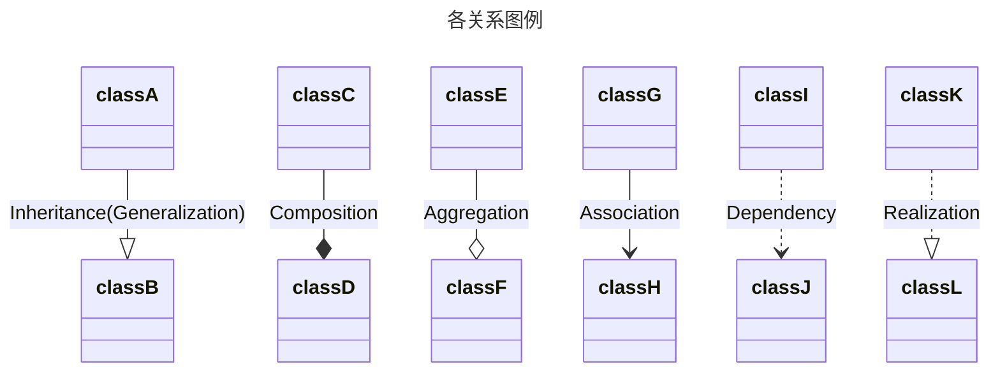

---
{"dg-publish":true,"permalink":"/zettel/202310162020-uml/","title":"202310162020","tags":["uml"],"created":"2023-10-16T20:20:29+08:00"}
---

UML图分类：

9种UML（Unified Modeling Language）模型图：

1. 用例图（Use-Case Diagram），静态图
2. 类图（Class Diagram），静态图
3. 对象图（Object Diagram），静态图
4. 状态图（State Diagram），动态图
5. 活动图（Activity Diagram），动态图
6. 顺序图（Sequence Diagram），动态图
7. 合作图（Communication Diagram），动态图
8. 组件图（Component Diagram），静态图
9. 部署图（Deployment Diagram），静态图

6种关系：

1. 实现（Realization）
2. 依赖（Dependency）
3. 泛化（Generalization）
4. 关联（Association）
5. 聚合（Aggregation）
6. 组合（Composition）

关系强弱顺序：泛化 = 实现 > 组合 > 聚合 > 关联 > 依赖

> [!TIP]
> 类图关系连线的箭头，指向内容和范围较小的类。

