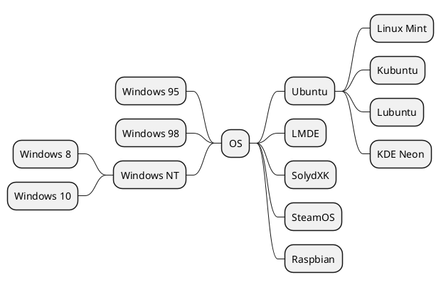

```plantuml
@startuml
' Base Classes
interface RefCounted {
  +{abstract} AddRef()
  +{abstract} ReleaseRef()
}

abstract class RefCountedImplT<T> {
  #m_RefCount: volatile int
  +AddRef()
  +ReleaseRef()
}

' Core Infrastructure
package "Core" {
  class IOManager
  class IOManagerImpl
  class Connection
  class Publisher
  class Service
  class Thread
}

' Network Classes
package "Network" {
  class TCPConnection
  class WebSocketConnection
  class MulticastConnection
  class RedisConnection
}

' Market Data Services  
package "MarketData" {
  class SHMarketHandler
  class SZMarketHandler
  class HKMarketHandler
  class L1Handler
  class L2Handler
}

' Threading
package "Threading" {
  class ASIOThread
  class WorkerThread
  class TimerThread
}

' Publishers
package "Publishers" {
  class TCPPublisher
  class WebSocketPublisher
  class MulticastPublisher
  class RedisPublisher
}

' Inheritance
RefCounted <|.. RefCountedImplT
RefCountedImplT <|-- IOManager
RefCountedImplT <|-- Connection
RefCountedImplT <|-- Publisher
RefCountedImplT <|-- Service
RefCountedImplT <|-- Thread

IOManager <|-- IOManagerImpl

Connection <|-- TCPConnection
Connection <|-- WebSocketConnection
Connection <|-- MulticastConnection
Connection <|-- RedisConnection

Thread <|-- ASIOThread
Thread <|-- WorkerThread
Thread <|-- TimerThread

Publisher <|-- TCPPublisher
Publisher <|-- WebSocketPublisher
Publisher <|-- MulticastPublisher
Publisher <|-- RedisPublisher

Service <|-- SHMarketHandler
Service <|-- SZMarketHandler
Service <|-- HKMarketHandler
Service <|-- L1Handler
Service <|-- L2Handler

@enduml
```

---
{"dg-publish":true,"permalink":"/zettel/202501211106kroki-sample/","title":202501211106,"tags":["kroki","draw","画图","uml","digram"],"created":"2025-01-21T11:06:22+08:00"}
---

先安装一下obsidian插件[kroki](https://kroki.io/)，然后可用。

---

```blockdiag
blockdiag {
  Kroki -> generates -> "Block diagrams";
  Kroki -> is -> "very easy!";

  Kroki [color = "greenyellow"];
  "Block diagrams" [color = "pink"];
  "very easy!" [color = "orange"];
}
```





```plantuml
@startuml

interface RefCounted
abstract class RefCountedImplT<T>
RefCounted <|.. RefCountedImplT

' Publisher hierarchy
class Publisher
class PublisherImpl
class TCPPublisher  
class RedisPublisher
class MulticastPublisher 
class WebsocketPublisher

RefCountedImplT <|-- Publisher
Publisher <|-- PublisherImpl
Publisher <|-- TCPPublisher
Publisher <|-- RedisPublisher  
Publisher <|-- MulticastPublisher
Publisher <|-- WebsocketPublisher

' Service hierarchy  
class Service
class SHL1HandlerThread
class SHL2HandlerThread  
class SZL1HandlerThread
class SZL2HandlerThread
class HKExHandlerThread
class NEEQHandlerThread
class MessageForwardHandler
class ReplayHandler
class XSHEHandlerThread
class MessageConvertHandler
class XSHEL1Forward
class L2RebuildHandler

RefCountedImplT <|-- Service
Service <|-- SHL1HandlerThread
Service <|-- SHL2HandlerThread
Service <|-- SZL1HandlerThread
Service <|-- SZL2HandlerThread 
Service <|-- HKExHandlerThread
Service <|-- NEEQHandlerThread
Service <|-- MessageForwardHandler
Service <|-- ReplayHandler
Service <|-- XSHEHandlerThread
Service <|-- MessageConvertHandler
Service <|-- XSHEL1Forward
Service <|-- L2RebuildHandler

' Connection hierarchy
class Connection
class TCPConnection
class RedisConnection
class WebsocketConnection
class MulticastConnection

RefCountedImplT <|-- Connection
Connection <|-- TCPConnection
Connection <|-- RedisConnection
Connection <|-- WebsocketConnection
Connection <|-- MulticastConnection

' IOManager hierarchy
class IOManager
class IOManagerImpl

RefCountedImplT <|-- IOManager
IOManager <|-- IOManagerImpl

' Thread hierarchy
class Thread
class ASIOThread
class WorkerThread
class TimerThread

RefCountedImplT <|-- Thread
Thread <|-- ASIOThread
Thread <|-- WorkerThread
Thread <|-- TimerThread

' Other classes
class HTTPHandler
class MessageQueue
class BlockingQueue
class RingBuffer
class SubscriberManager
class MessageDispatcher

RefCountedImplT <|-- HTTPHandler
RefCountedImplT <|-- MessageQueue
MessageQueue <|-- BlockingQueue
MessageQueue <|-- RingBuffer
RefCountedImplT <|-- SubscriberManager
RefCountedImplT <|-- MessageDispatcher

@enduml
```

```pikchr
$r = 0.2in
linerad = 0.75*$r
linewid = 0.25

# Start and end blocks
#
box "element" bold fit
line down 50% from last box.sw
dot rad 250% color black
X0: last.e + (0.3,0)
arrow from last dot to X0
move right 3.9in
box wid 5% ht 25% fill black
X9: last.w - (0.3,0)
arrow from X9 to last box.w


# The main rule that goes straight through from start to finish
#
box "object-definition" italic fit at 11/16 way between X0 and X9
arrow to X9
arrow from X0 to last box.w

# The LABEL: rule
#
arrow right $r from X0 then down 1.25*$r then right $r
oval " LABEL " fit
arrow 50%
oval "\":\"" fit
arrow 200%
box "position" italic fit
arrow
line right until even with X9 - ($r,0) \
  then up until even with X9 then to X9
arrow from last oval.e right $r*0.5 then up $r*0.8 right $r*0.8
line up $r*0.45 right $r*0.45 then right

# The VARIABLE = rule
#
arrow right $r from X0 then down 2.5*$r then right $r
oval " VARIABLE " fit
arrow 70%
box "assignment-operator" italic fit
arrow 70%
box "expr" italic fit
line right until even with X9 - ($r,0) \
  then up until even with X9 then to X9

# The PRINT rule
#
arrow right $r from X0 then down 3.75*$r then right $r
oval "\"print\"" fit
arrow
box "print-args" italic fit
line right until even with X9 - ($r,0) \
  then up until even with X9 then to X9
```




